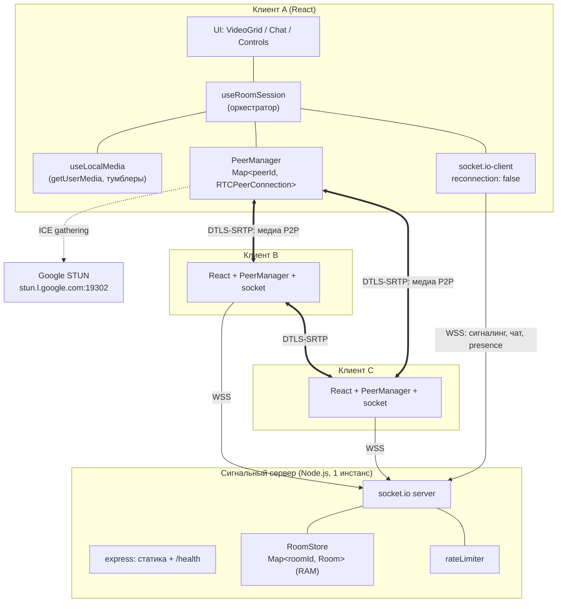
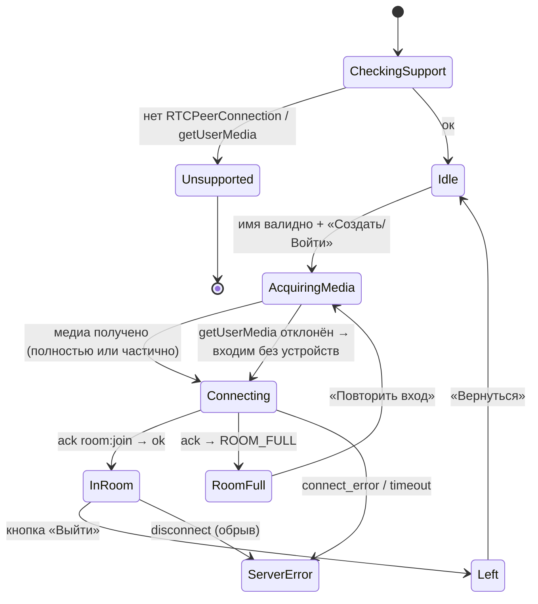
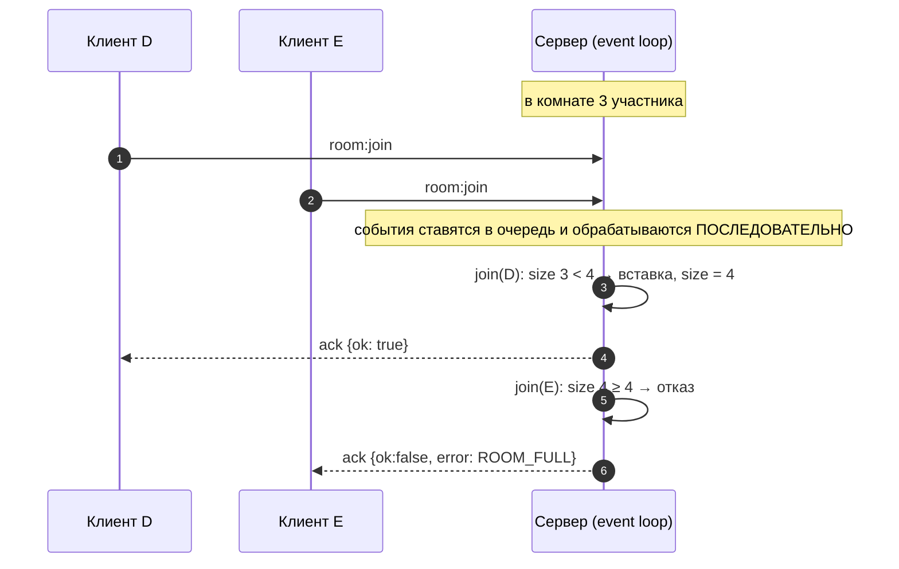
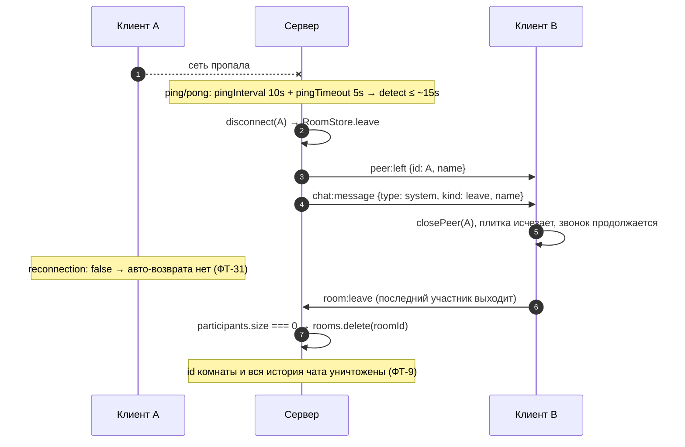
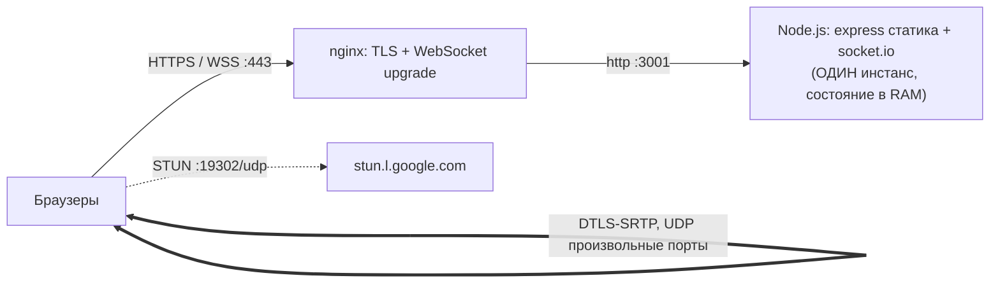

# Technical Design Document — Видеочат-комната (`video-chat-room`)

| | |
|---|---|
| **Документ** | Technical Design Document (TDD) |
| **Версия** | **2.0 — реализовано** |
| **Основан на** | `prd-video-chat-room.md` v1.0 |
| **Шаблон** | `prd-design.mdc` |
| **feature-name** | `video-chat-room` |
| **Статус** | Реализовано полностью. Открытые вопросы Q1–Q11 закрыты в группе 0 (см. §14); все 40 ФТ и 13 US реализованы и покрыты тестами |

**Изменения в v2.0** (группа 16, задача 16.3): документ переведён из состояния «дизайн» в состояние «дизайн + фактическая реализация». Правки по существу вносились по ходу групп 0–15 (история ниже), поэтому финальная ревизия — это сверка, а не переписывание.

★ **Отклонение от плана 16.3, зафиксированное осознанно.** План предписывал создать отдельный файл `design-video-chat-room-v2.md`. Вместо этого документ обновлён **на месте** с повышением версии до 2.0. Причина: TDD правился в каждой группе (v1.1 … v1.18), и каждое отклонение реализации от исходного дизайна фиксировалось сразу — второй файл был бы копией на 1300 строк, которая начала бы расходиться с первой при первой же правке. Два источника истины про архитектуру хуже одного с историей версий.

**Что дала реализация сверх исходного дизайна** — разделы, появившиеся не из планирования, а из найденных дефектов:

| Раздел | Что добавлено | Откуда |
|---|---|---|
| §4.5, нюанс 8 | защита от повторного оффера при нескольких `negotiationneeded` | тест группы 8 |
| §4.7 | правило стабильной идентичности `ref`-колбэка; инвариант размеров плитки | группы 10 и ручная приёмка |
| §4.7 | три правила политики автозапуска | группа 11 |
| §8.1 | «текст ошибки не должен преувеличивать проблему» | ручная приёмка группы 13 |
| §10.3 | порядок санитизации: управляющие символы сворачиваются, а не удаляются | группа 2 |
| §10.4 | порог сигналинга выведен **из измерения**: Firefox даёт 99 ICE-кандидатов против 8 у Chromium | группа 14 |
| §11.1 | два project'а vitest; фактическое покрытие 94 % | группа 12 |
| §11.4 | три отклонения от исходных формулировок E2E-сценариев, каждое проверено пробой в браузере | группа 13 |
| §11.5 | две «неавтоматизируемые» проверки автоматизированы | группа 14 |
| §12.3 | «образ обязан запускаться, а не только собираться» | группа 15 |
| §12.4 | принудительное закрытие соединений: `httpServer.close()` ждал keep-alive браузера 81 секунду | ручная приёмка группы 9 |

**Изменения в v1.1** (группа 0 Implementation Plan): §2.1 заполнен фактической сводкой репозитория (Q1); §14 переработан — Q1–Q4 закрыты решениями, Q5–Q11 зафиксированы дефолтами в `server/src/config.ts` и `client/src/config.ts`; §12.5 дополнен флагами, реализующими Q5, Q9–Q11. Архитектурных изменений нет.

**Изменения в v1.2** (группа 1): §2.1 дополнен составом созданного каркаса и отклонениями от дерева §2.2; §12.5 дополнен флагом `TRUST_PROXY`. Архитектурных изменений нет.

**Изменения в v1.3** (группа 2): §2.1 дополнен составом общего пакета; §10.3 уточнён порядок санитизации имени (управляющие символы сворачиваются в пробел, а не удаляются, — иначе слова склеиваются). Контракт §6.2 реализован без отклонений.

**Изменения в v1.4** (группа 3): §2.1 дополнен `server/src/RoomStore.ts`; §4.2 дополнен фактическим составом API стора и правилом «один сокет — один слот». Архитектура и инварианты §4.2/§7.2 реализованы без отклонений.

**Изменения в v1.18** (группа 15): §12.2 дополнен реализацией nginx и автоматизацией проверки сетевых предусловий; §12.3 дополнен фактическим составом пайплайна и правилом «образ обязан запускаться, а не только собираться»; §2.1 дополнен составом `deploy/`, `scripts/` и `.github/`. Архитектурных изменений нет; в Dockerfile исправлено копирование вложенных зависимостей воркспейса и добавлена проверка разрешимости импортов на этапе сборки.

**Изменения в v1.17** (группа 14): §11.5 переработан — две проверки переведены из ручных в автоматические (утечки ресурсов и Firefox), для остальных зафиксировано, почему они ручные; §10.4 дополнен выводом порога сигналинга из измерения — прежние 100 событий отключали легитимных пользователей Firefox. Архитектурных изменений нет; потолок битрейта вынесен в опции `PeerManager`, чтобы включённое состояние можно было проверить тестом.

**Изменения в v1.16** (ручная приёмка группы 13): §8.1 дополнен правилом «текст ошибки не должен преувеличивать проблему» — при отказе только в камере формулировка про микрофон недопустима.

**Изменения в v1.15** (группа 13): §11.4 дополнен фактическим составом E2E (27 тестов), способом чтения `getStats()` без тестового кода в приложении и тремя отклонениями от исходных формулировок сценариев, каждое из которых проверено пробой в браузере; §2.1 дополнен составом `e2e/`. Архитектурных изменений нет; в `localMedia.toMediaErrorKind` устранена зависимость от `instanceof Error`.

**Изменения в v1.14** (группа 12): §11.1 дополнен фактическим покрытием (93,98 % строк при цели ≥ 75 %) и решением о двух project'ах vitest; §2.1 дополнен составом компонентных тестов, вынесенным `videoAttachments.ts` и удалением двух неиспользуемых хуков. Архитектурных изменений нет.

**Изменения в v1.13** (группа 11): §4.7 дополнен реализацией политики автозапуска — что считается блокировкой и почему `play()` для всех элементов вызывается синхронно внутри жеста; §8.1 дополнен правилом «у каждого состояния свой экран» и запретом заглушать элемент ради автозапуска. Архитектурных изменений нет; закрыто последнее требование, не затронутое кодом (ФТ-37).

**Изменения в v1.12** (ручная приёмка группы 10): §4.7 дополнен инвариантом размеров плитки — таблицей «правило → что ломается без него». Поводом стала регрессия: при переписывании `styles.css` пропали правила `.tile__media` / `.tile__video` / `.tile__caption`, из-за чего раскладку стал задавать собственный размер видеопотока (плитка росла ступенями), а заглушка-силуэт отсчитывалась от страницы. Архитектурных изменений нет.

**Изменения в v1.11** (группа 10): §2.1 дополнен компонентами UI комнаты; §4.7 дополнен правилом стабильной идентичности `ref`-колбэка (иначе `React.memo` бессмыслен); §4.8 дополнен решением про раскладку по числу участников вместо `auto-fit`.

**Изменения в v1.10** (группа 9): §2.1 дополнен оркестратором; §4.6 дополнен фактическим составом связок и порядком «сначала устройства, потом сокет». Веха M2 достигнута на уровне протокола.

**Изменения в v1.9** (группа 8): §2.1 дополнен `PeerManager`; §4.5 дополнен восьмым нюансом — защитой от повторного оффера при нескольких событиях `negotiationneeded`.

**Изменения в v1.8** (группа 7): §2.1 дополнен модулем локальных дорожек; §4.4 дополнен решениями по повторному запросу устройства, гонке «ушёл во время запроса разрешения» и шву для `PeerManager`.

**Изменения в v1.7** (группа 6): §2.1 дополнен клиентским socket-слоем; §4.1 дополнен решениями по таймауту ack, обработке кодов ошибок и единому teardown. Веха M1 закрыта в части backend + presence.

**Изменения в v1.6** (группа 5): §2.1 дополнен модулями каркаса клиента; §3.3 дополнен фактическими именами действий reducer'а и решением про передачу имени через состояние навигации. Машина состояний реализована без отклонений.

**Изменения в v1.5** (группа 4): §2.1 дополнен модулями обработчиков, лимитера и shutdown; §4.3 дополнен решениями по мусорному `media` и порядку системного сообщения о входе; §10.4 дополнен фактическим составом CSP. Контракт §6.2 реализован полностью, отклонений нет.

---

## 1. Overview / Контекст

### 1.1 Цель

Реализовать веб-приложение группового видеозвонка до 4 участников с текстовым чатом. PRD: `prd-video-chat-room.md` v1.0. Документ описывает **как** это построить: модули, контракты, потоки, крайние случаи.

### 1.2 Жёсткие ограничения, вытекающие из PRD

| Ограничение | Источник | Техническое следствие |
|---|---|---|
| Стек: ES6+ / Node.js / React / Socket.io / «чистый» WebRTC | PRD §7 | Никакого SFU (LiveKit/mediasoup/Janus), несмотря на референс-демо |
| Топология mesh P2P | PRD §7 | N·(N−1)/2 соединений; 4 участника = 6 PC на комнату, 3 исходящих потока на клиента |
| Максимум 4 участника, проверка **атомарна на сервере** | F-05, US-5 | Проверка лимита — синхронный участок без `await` (см. §4.2) |
| Нет БД, нет персистентности | PRD §7 | Состояние комнат в памяти процесса → **следствие: сервер запускается в одном инстансе** (см. §13) |
| Нет `localStorage`/`sessionStorage` | PRD §5 | Состояние только в React-памяти; перезагрузка = новый вход |
| Нет auto-reconnect | F-18, PRD §5 | `reconnection: false` в socket.io-client (см. §4.1) |
| Нет TURN, только публичные Google STUN | PRD §7 | Часть пар за симметричным NAT не соединится — это допустимый исход, обрабатывается на уровне плитки (см. §8.4) |
| Выключение камеры **освобождает устройство** | ФТ-19, US-7 | `track.stop()` + `sender.replaceTrack(null)` — ключевой нюанс, см. §4.4 |
| HTTPS обязателен | PRD §7 | `getUserMedia` только в secure context; влияет на dev-окружение и LAN-тесты (§12.1) |
| Задержка ≤ 500 мс в LAN | PRD §7 | Достижимо «бесплатно» за счёт P2P без серверного хопа; верификация через `getStats()` (§9.4) |
| Интерфейс только на русском | PRD §6 | Строки в одном модуле `strings.ts`, без i18n-библиотеки |
| Только десктоп ≥1024px, Chrome/FF/Edge 100+ | PRD §2, §7 | Нет мобильных breakpoint'ов; нет обходных путей для Safari (см. §13) |

### 1.3 Вне области этого TDD

Всё из PRD §5 (Non-Goals). Дополнительно на техническом уровне не проектируются: горизонтальное масштабирование сигналинга, метрики/observability сверх логов, мониторинг качества связи, CI-матрица браузеров.

---

## 2. Current Architecture & Codebase Summary

### 2.1 Статус исследования кода

> **Q1 закрыт (задача IP 0.1).** Репозиторий предоставлен и прочитан целиком. Кода в нём нет: только три документа процесса. Допущение «greenfield» подтверждено фактом, а не принято на веру.

Полная сводка содержимого на момент старта работ:

| Путь | Что это | Назначение | Влияние на дизайн |
|---|---|---|---|
| `prd-video-chat-room.md` (v1.0, 45 КБ) | PRD | 13 user stories (US-1…13), 40 функциональных требований (ФТ-1…40), Non-Goals, технические ограничения | источник требований; трассируется в Приложении A |
| `design-video-chat-room.md` (v1.1, этот файл) | TDD | архитектура, контракты, потоки, крайние случаи, риски | — |
| `impl-video-chat-room.md` (v1.0, 40 КБ) | Implementation Plan | 17 групп (0…16) / 78 атомарных подзадач, вехи M0–M5 | порядок реализации |

Чего в репозитории **нет** (проверено): `package.json`, `node_modules`, любых `.ts`/`.tsx`/`.js`, конфигов сборки и линтеров, Dockerfile, CI-конфигурации, каталогов `client/`, `server/`, `shared/`. Инициализированного git-репозитория тоже нет — первый коммит предстоит сделать в задаче 1.1.

Следствия:

- существующих имён модулей, с которыми нужно сверять §3–§6, не существует — структура §2.2 является одновременно целевой и фактической;
- правило `prd-design.mdc` (п. 2 «Исследовать текущий код») выполнено в полном объёме: читать было нечего, и это установленный факт, а не пробел в исследовании;
- обратной совместимости, миграции и легаси-ограничений нет ни на одном слое.

Появившиеся с тех пор файлы:

- **группа 0:** `server/src/config.ts`, `client/src/config.ts`, `.nvmrc` — дефолты Q5–Q11 и фиксация версии Node;
- **группа 1:** каркас монорепо (npm workspaces `shared`/`server`/`client`, `tsconfig.base.json` + конфиги воркспейсов, ESLint 9 flat + Prettier, vitest), рабочий сервер (`server/src/index.ts`, `http/app.ts`, `http/internalAddress.ts`, `socket/createSocketServer.ts`, `logger.ts`), общий пакет (`shared/src/protocol.ts`), bootstrap клиента (`client/index.html`, `src/main.tsx`, `src/App.tsx`, `vite.config.ts`), `Dockerfile` + `docker-compose.yml`.

- **группа 2:** общий контракт — `shared/src/types.ts` (данные), `events.ts` (события, ack, перечисления ошибок), `validation.ts` (zod-схемы), `limits.ts` (числовые лимиты и классы символов);
- **группа 3:** `server/src/RoomStore.ts` — состояние комнат в памяти, подключён к `GET /health` (счётчики стали фактическими);
- **группа 15:** доставка — `.github/workflows/ci.yml` (7 шагов §12.3 в четырёх job'ах), `deploy/nginx/video-chat.conf`, `scripts/check-network.mjs` (проверка STUN без зависимостей), runbook `docs/deploy-video-chat-room.md`; в `Dockerfile` исправлено копирование `server/node_modules` и добавлена проверка импортов;
- **группа 13:** E2E — `playwright.config.ts`, `e2e/{helpers.ts,call.spec.ts,chat.spec.ts,media.spec.ts,lifecycle.spec.ts,errors.spec.ts,tsconfig.json}`; в `localMedia.toMediaErrorKind` имя ошибки читается у любого объекта, а не только у `instanceof Error`;
- **группа 12:** компонентные тесты — `App.dom.test.tsx`, `components/{JoinScreen,VideoTile,ChatPanel,Controls}.dom.test.tsx`, `components/overlays/errorScreens.dom.test.tsx`, setup-файл `domMatchers.test-utils.ts`; привязка потоков к элементам вынесена из `useRoomSession` в `services/videoAttachments.ts`; **удалены** `hooks/useLocalMedia.ts` и `hooks/useRoomConnection.ts` — их поглотил `useRoomSession` в группе 9, и с тех пор они не использовались;
- **группа 11:** экраны и оверлеи — `components/overlays/{ErrorScreen,RoomFullScreen,ServerErrorScreen,LeftScreen,InvalidLinkScreen,StatusScreen,MediaErrorBanner,UnmuteAudioGate}.tsx`, `lib/autoplay.ts`, привязка автозапуска в `useRoomSession`, плашка состояния соединения в `VideoTile`; `switch` в `RoomPage` стал исчерпывающим без `default`;
- **группа 10:** UI комнаты — `components/{VideoTile,VideoGrid,Controls,ChatPanel,ParticipantList}.tsx`, `hooks/useAutoScroll.ts`, `lib/copyLink.ts`; отправка сообщений в `roomConnection` / `roomSession`;
- **группа 9:** `client/src/services/roomSession.ts` и `hooks/useRoomSession.ts` — оркестратор: подписки, потоки вне состояния React, единый teardown; в `RoomPage` временная сетка плиток;
- **группа 8:** `client/src/services/PeerManager.ts` — mesh WebRTC: фиксированные трансиверы, антиглэр, perfect negotiation, буфер ICE, один поток на пира, restartIce, детерминированный teardown; мок соединения в `peerConnection.test-utils.ts`;
- **группа 7:** `client/src/services/localMedia.ts` и `hooks/useLocalMedia.ts` (хук удалён в группе 12 как неиспользуемый) — раздельные `getUserMedia`, тумблеры, реакция на потерю устройства, `teardown`; в `RoomPage` временный self-view и тумблеры;
- **группа 6:** `client/src/services/{socket,roomConnection}.ts` и `hooks/useRoomConnection.ts` (хук удалён в группе 12 как неиспользуемый) — подключение, вход в комнату, трансляция ошибок транспорта в экраны; временное представление комнаты в `RoomPage`;
- **группа 5:** каркас клиента — `client/src/lib/{support,validation,format}.ts`, `state/roomReducer.ts`, `strings.ts`, `styles.css`, `components/{JoinScreen,RoomPage}.tsx`, `components/overlays/UnsupportedScreen.tsx`, роутинг в `App.tsx`, проверка поддержки в `main.tsx`;
- **группа 4:** `server/src/socket/socketHandlers.ts` (все события контракта), `socket/types.ts` (типизированные псевдонимы socket.io), `rateLimiter.ts` (token bucket + скользящее окно), `shutdown.ts` (graceful shutdown), `helmet` + CSP в `http/app.ts`, стенд `socket/harness.test-utils.ts` для integration-тестов.

Отклонения от дерева §2.2, принятые при реализации (структура уточнена, состав — нет): серверные модули разложены по подкаталогам `server/src/http/` и `server/src/socket/` вместо плоского `server/src/`; вместо одного `shared/events.ts` пакет разложен на пять модулей с общим barrel `index.ts` (`protocol`, `limits`, `types`, `events`, `validation`) — разделение данных, транспорта и валидации; у `shared` и `server` есть отдельные `tsconfig.build.json`, чтобы тесты не попадали в `dist`.

Числовые лимиты (длина имени и сообщения, глубина истории, лимит участников) объявлены в `shared/src/limits.ts` и используются как дефолты обеими конфигурациями: один литерал вместо трёх копий. Пакет помечен `"sideEffects": false`, иначе barrel-реэкспорт схем затягивает `zod` в клиентский бандл (+17 КБ gzip) даже там, где валидация не используется.

### 2.2 Целевая структура репозитория (монорепо)

```
video-chat-room/
├── package.json               # workspaces: client, server; скрипты dev/build/test
├── docker-compose.yml         # локальный прод-подобный запуск
├── client/
│   ├── vite.config.ts         # dev-server + https + proxy /socket.io -> :3001
│   └── src/
│       ├── main.tsx           # bootstrap; проверка поддержки WebRTC до монтирования App
│       ├── App.tsx            # роутинг: "/" -> JoinScreen, "/:roomId" -> RoomPage
│       ├── config.ts          # ICE_SERVERS, MAX_NAME_LEN, MAX_MESSAGE_LEN, SOCKET_URL
│       ├── strings.ts         # все русские строки UI и текстов ошибок
│       ├── types.ts           # общие типы, реэкспорт из shared/
│       ├── lib/
│       │   ├── support.ts     # detectWebRtcSupport(): проверка RTCPeerConnection + getUserMedia
│       │   ├── validation.ts  # клиентские валидаторы имени/сообщения (зеркало серверных)
│       │   └── format.ts      # formatTime(ts) -> "HH:MM" по локали клиента
│       ├── services/
│       │   ├── socket.ts      # создание/уничтожение socket, reconnection: false
│       │   └── PeerManager.ts # ★ ядро mesh: Map<peerId, PeerEntry>, perfect negotiation
│       ├── hooks/
│       │   ├── useLocalMedia.ts   # ★ getUserMedia, тумблеры, пересоздание видеодорожки
│       │   ├── useRoomSession.ts  # ★ оркестратор: сигналинг ⇄ PeerManager ⇄ React-state
│       │   └── useAutoScroll.ts   # автопрокрутка чата с учётом «пользователь проскроллил вверх»
│       ├── state/
│       │   └── roomReducer.ts  # редьюсер комнаты: participants, messages, mediaStates
│       └── components/
│           ├── JoinScreen.tsx      # ввод имени, «Создать комнату» / «Войти»
│           ├── RoomPage.tsx        # композиция комнаты, машина состояний экрана
│           ├── VideoGrid.tsx       # CSS-grid 1/2/3-4 плитки
│           ├── VideoTile.tsx       # ★ <video> НЕ размонтируется; заглушка — оверлеем
│           ├── Controls.tsx        # микрофон / камера / копировать ссылку / выйти
│           ├── ChatPanel.tsx       # история + ввод
│           ├── ParticipantList.tsx
│           └── overlays/           # RoomFullScreen, ServerErrorScreen, UnsupportedScreen,
│                                   # MediaErrorBanner, UnmuteAudioGate
├── server/
│   └── src/
│       ├── index.ts            # http(s) + express (раздача статики) + socket.io
│       ├── config.ts           # PORT, MAX_PARTICIPANTS, MAX_MESSAGES, лимиты, CORS_ORIGIN
│       ├── RoomStore.ts        # ★ Map<roomId, Room>; атомарный join, удаление пустых комнат
│       ├── socketHandlers.ts   # ★ регистрация обработчиков событий на сокете
│       ├── validation.ts       # схемы roomId/name/text, санитизация
│       ├── rateLimiter.ts      # token bucket на сокет
│       └── logger.ts           # pino; без логирования текста сообщений
└── shared/
    └── events.ts               # ★ единый контракт событий и payload'ов для клиента и сервера
```

★ — модули, содержащие основную техническую сложность.

### 2.3 Внешние зависимости

| Пакет | Роль | Обоснование |
|---|---|---|
| `react`, `react-dom` 18+ | UI | требование PRD |
| `react-router-dom` 6 | маршрут `/:roomId` | URL как ссылка-приглашение |
| `socket.io` / `socket.io-client` 4.x | сигналинг + чат | требование PRD |
| `express` 4 | раздача статики, `/health` | минимальный HTTP-слой |
| `nanoid` | генерация `roomId` | криптостойкий, короткий URL |
| `zod` | валидация входящих payload'ов | одна схема = валидация + типы |
| `pino` | логи | низкий overhead |
| `vitest`, `@testing-library/react` | unit/integration | нативно с Vite |
| `@playwright/test` | E2E с fake-media | единственный практичный способ проверить 4 участников |

TypeScript используется как надмножество ES6+ (`shared/events.ts` даёт один источник истины для контрактов). При требовании «строго plain JS» типы выносятся в JSDoc — конструкции дизайна не меняются.

---

## 3. Proposed Architecture / High-Level Design

### 3.1 Компонентная схема



Ключевое разделение: **сервер видит только сигналинг, presence и текст; медиа через сервер не проходит**. Это даёт задержку ≤500 мс в LAN и нулевую нагрузку на канал сервера, но фиксирует лимит в 4 участника.

### 3.2 Слои клиента и правило зависимостей

```
components (React)  →  hooks  →  services (PeerManager, socket)  →  Web API
        ↑                ↓
     roomReducer  ←──────┘
```

Правила: компоненты не обращаются к `RTCPeerConnection` и `socket` напрямую; `PeerManager` не знает про React (обычный класс с колбэками) — это делает его тестируемым в изоляции и исключает лишние ре-рендеры при каждом ICE-кандидате.

### 3.3 Машина состояний экрана (клиент)



Важно: `AcquiringMedia` **не может** привести к терминальной ошибке — отказ в доступе к устройствам (F-33) переводит в `Connecting` с пустыми дорожками.

Реализация (группа 5): переходы описаны действиями `SUPPORT_OK` / `SUPPORT_FAILED` / `NAME_SUBMITTED` / `MEDIA_READY` / `MEDIA_FAILED` / `JOINED` / `ROOM_FULL` / `SERVER_ERROR` / `RETRY_JOIN` / `LEFT` / `BACK_TO_IDLE` в `client/src/state/roomReducer.ts`; недопустимые переходы возвращают то же состояние, а не бросают исключение. Свойство «ошибка медиа не терминальна» закреплено параметризованным тестом по всем шести кодам `MediaErrorKind`.

Имя со стартового экрана передаётся на `/:roomId` **через переменную в памяти модуля** (`client/src/lib/pendingJoin.ts`), а не через URL, web storage или состояние навигации react-router:

- в URL имя попадать не должно — ссылкой делятся;
- web storage запрещён PRD §5;
- **состояние навигации react-router не подходит**: оно сериализуется в запись истории браузера и переживает перезагрузку страницы, из-за чего F5 не спрашивал бы имя заново. Это нарушало ФТ-28 и было найдено на ручной приёмке группы 5.

Переменная в памяти модуля живёт ровно до перезагрузки, то есть точно столько, сколько нужно. Чтение идемпотентно: в React StrictMode инициализатор `useReducer` вызывается дважды, и семантика «прочитал — стёр» потеряла бы имя.

Порядок проверок в `detectWebRtcSupport` (§8.1): **secure context проверяется раньше наличия API.** На небезопасном origin Chrome не создаёт `navigator.mediaDevices`, поэтому обратный порядок давал бы неверное сообщение «браузер не поддерживает WebRTC» вместо объяснения про HTTPS.

---

## 4. Components & Interfaces

### 4.1 `services/socket.ts`

Ответственность: единственная точка создания соединения и трансляции low-level ошибок в состояния UI.

```ts
export function createSocket(): Socket<ServerToClient, ClientToServer> {
  return io(SOCKET_URL, {
    transports: ['websocket'],   // без long-polling: не нужен, экономит апгрейд-раунд
    reconnection: false,         // ★ PRD: auto-reconnect отсутствует по требованию F-18
    timeout: 8000,
    autoConnect: false,          // подключаемся только после ввода имени
  });
}
```

Решения, принятые при реализации (группа 6):
- **Таймаут на ack `room:join`.** Без него клиент, отправивший `join` в момент падения сервера, остался бы на экране «Подключаемся…» навсегда. Молчание сервера трактуется как ошибка соединения (ФТ-35), а не как отдельное состояние.
- **Разные коды — разные пути.** `ROOM_FULL` → экран «Комната заполнена» с рабочим повтором (сокет при этом закрывается, чтобы не занимать слот наблюдателем); `INVALID_ROOM_ID` → возврат на `/`; `INVALID_NAME` / `ALREADY_JOINED` → экран ошибки сервера, потому что оба означают дефект клиента и должны быть заметны, а не проглочены.
- **Единый teardown.** Любой терминальный путь (`connect_error`, таймаут, незапрошенный `disconnect`, `leave`, размонтирование) проходит через одну функцию, которая освобождает медиа и закрывает сокет. Она идемпотентна: обрыв часто порождает несколько событий подряд, а камера должна гаснуть один раз и наверняка (риск R7).
- **Собственный `disconnect` отличается от обрыва** по `reason === 'io client disconnect'`: иначе штатный выход показывал бы экран ошибки.
- Логика вынесена в модуль без зависимости от React (`services/roomConnection.ts`), поэтому все ветки проверяются на живом socket.io-сервере без рендера компонентов.

Нюансы:
- `reconnection: false` — прямая реализация требования «участник выбывает и возвращается только вручную». Без этого socket.io сам восстановит соединение с **новым** socket.id, оставив на сервере фантомного участника до истечения ping-таймаута.
- Обрыв должен детектироваться быстро, иначе слот «висит». Серверные `pingInterval: 10_000`, `pingTimeout: 5_000` → удаление участника в пределах ~15 с. Уменьшать дальше рискованно: на нестабильном Wi-Fi это даст ложные выбытия.
- `connect_error` → экран `ServerError` (требование ФТ-35). Различать «сервер лежит» и «нет интернета» не требуется — текст один.

### 4.2 `server/RoomStore.ts`

Ответственность: единственный владелец состояния комнат; атомарный контроль лимита; жизненный цикл комнаты.

```ts
interface Participant {
  id: string;            // = socket.id, уникален в пределах процесса
  name: string;          // валидированное, ≤30 символов
  media: MediaState;     // { audio: boolean; video: boolean }
  joinedAt: number;
}

interface Room {
  id: string;
  participants: Map<string, Participant>;
  messages: ChatItem[];  // ring buffer, ≤ MAX_MESSAGES
  createdAt: number;
}

type JoinResult =
  | { ok: true; room: Room; self: Participant }
  | { ok: false; error: 'ROOM_FULL' };

/**
 * ★ Атомарность. Функция строго синхронна: между проверкой размера
 * и вставкой участника НЕТ ни одного await / process.nextTick / I/O.
 * Однопоточный event loop Node.js гарантирует, что два одновременных
 * room:join исполнятся последовательно → US-5 «гонка за последний слот»
 * решается без блокировок и мьютексов.
 * Любое будущее добавление await внутрь этой функции ломает требование F-05.
 */
join(roomId: string, socketId: string, name: string, media: MediaState): JoinResult {
  let room = this.rooms.get(roomId);
  if (!room) {
    room = { id: roomId, participants: new Map(), messages: [], createdAt: Date.now() };
    this.rooms.set(roomId, room);           // ФТ-5: любой URL создаёт комнату
  }
  if (room.participants.size >= MAX_PARTICIPANTS) {
    if (room.participants.size === 0) this.rooms.delete(roomId); // не оставляем пустышку
    return { ok: false, error: 'ROOM_FULL' };
  }
  const self: Participant = { id: socketId, name, media, joinedAt: Date.now() };
  room.participants.set(socketId, self);
  return { ok: true, room, self };
}

/** Возвращает удалённого участника; удаляет комнату при падении счётчика до нуля (ФТ-9). */
leave(roomId: string, socketId: string): Participant | null {
  const room = this.rooms.get(roomId);
  if (!room) return null;
  const p = room.participants.get(socketId) ?? null;
  room.participants.delete(socketId);
  if (room.participants.size === 0) this.rooms.delete(roomId); // ★ id и история чата исчезают
  return p;
}
```

Фактический состав API (группа 3): `get`, `createIfAbsent`, `join`, `leave`, `getParticipant`, `updateMedia`, `addMessage` + обёртки `addUserMessage` / `addSystemMessage`, `snapshot`, `stats`. Лимиты, источник времени и генератор `messageId` инжектируются через конструктор — иначе тесты истории и ring buffer пришлось бы писать на реальных `Date.now()` и `nanoid`.

Дополнительный инвариант, введённый при реализации: **один сокет — один слот.** Повторный `join` тем же `socket.id` возвращает `ALREADY_JOINED` (код уже есть в контракте §6.2), а не переписывает участника молча. Требование ФТ-29 «несколько вкладок = несколько участников» при этом не нарушено: у каждой вкладки свой сокет.

Нюансы:
- `MAX_PARTICIPANTS` — из env, дефолт 4. Служит и «feature-flag'ом» для нагрузочных экспериментов, и защитой от хардкода.
- Комната удаляется **немедленно**, без grace-периода. Иначе перезагрузка страницы «унаследовала» бы историю чата, что противоречит ФТ-9 и «перезагрузка = новый вход».
- `messages` — ring buffer с потолком (`MAX_MESSAGES = 200`): без него комната живёт неограниченно долго и растёт в памяти. Поздний участник получает последние 200 сообщений — требование ФТ-23 («видит сообщения до входа») это удовлетворяет.
- Хранить `Map`, а не массив: удаление участника при disconnect по ключу — O(1), и `socket.id` естественно уникален.

### 4.3 `server/socketHandlers.ts`

Ответственность: валидация входящих событий, релей сигналинга, широковещание presence и чата.

```ts
socket.data.roomId  // ★ источник истины «где сокет»; ставится только в room:join
```

Решения, принятые при реализации (группа 4):
- **Мусорное `media` в `room:join` не отклоняет вход**, а трактуется как «оба устройства выключены». Контракт `JoinError` не содержит кода для некорректного состояния устройств, а требование ФТ-14 прямо разрешает вход без устройств — отказ был бы строже требования.
- **Системное сообщение о входе добавляется после снятия снапшота** и рассылается всем, включая вошедшего. Иначе вошедший получил бы его дважды: в истории снапшота и событием.
- **Порядок в `room:join`**: ack отправляется до broadcast'ов `peer:joined` и `chat:message`, чтобы клиент успел подготовить состояние до первых событий комнаты.
- **`socket.data.roomId` удаляется (`delete`) в самом начале обработки выхода**, до обращения к стору: повторный `room:leave` и гонка `room:leave` + `disconnect` не должны приводить к двойной рассылке `peer:left`.

Нюансы:
- **Релей проверяет принадлежность к комнате.** Перед пересылкой `signal:*` сервер убеждается, что `payload.to` — участник **той же** комнаты, что и `socket.data.roomId`. Без этой проверки любой клиент может инжектировать SDP/ICE в чужую комнату по угаданному socket.id.
- Отписка выполняется в `socket.on('disconnect')`, а не `'disconnecting'`: собственный `socket.data.roomId` доступен в обоих, а внутренние `socket.rooms` уже не нужны — комнаты socket.io используются только как транспорт для broadcast (`socket.to(roomId).emit(...)`).
- Сокет, не прошедший `room:join`, игнорируется всеми остальными обработчиками (`NOT_IN_ROOM`) — защита от подключений «в обход» сценария.
- `maxHttpBufferSize: 100_000` (100 КБ). Важно не занижать: SDP-оффер с несколькими кандидатами — единицы килобайт, но с `iceCandidatePoolSize` и множеством интерфейсов легко доходит до 10–20 КБ. Слишком маленький буфер приведёт к разрыву сокета в момент негоциации.

### 4.4 `hooks/useLocalMedia.ts` — ★ главный нюанс реализации

Ответственность: владение локальными дорожками, тумблеры микрофона и камеры, реакция на потерю устройства.

**Микрофон и камера ведут себя принципиально по-разному, и это следует из PRD, а не из удобства:**

| | Микрофон (ФТ-15/16) | Камера (ФТ-17/18/19) |
|---|---|---|
| Требование | «аудио перестаёт передаваться» | «камера физически перестаёт использоваться, лампочка гаснет» |
| Реализация выключения | `track.enabled = false` | `track.stop()` + `sender.replaceTrack(null)` |
| Дорожка после выключения | жива, отдаёт тишину | уничтожена |
| Реализация включения | `track.enabled = true` | `getUserMedia({video})` заново + `sender.replaceTrack(newTrack)` |
| Ренегоциация SDP | не нужна | **не нужна** (см. ниже) |
| Задержка включения | ~0 мс | 150–600 мс (аппаратный запуск камеры) |

```ts
async function enableCamera() {
  // Повторный getUserMedia: браузер уже имеет persistent permission,
  // повторный промпт не показывается (Chrome/FF/Edge).
  const stream = await navigator.mediaDevices.getUserMedia({ video: VIDEO_CONSTRAINTS });
  const track = stream.getVideoTracks()[0];
  track.addEventListener('ended', handleDeviceLost);   // ФТ-20: потеря устройства
  peerManager.replaceOutgoingVideo(track);             // во ВСЕ 3 peer connection
  setLocal({ videoTrack: track, video: true });
  socket.emit('media:state', { audio: micOn, video: true });
}

function disableCamera() {
  peerManager.replaceOutgoingVideo(null);  // sender.replaceTrack(null) на всех PC
  local.videoTrack?.stop();                // ★ гасит аппаратный индикатор
  setLocal({ videoTrack: null, video: false });
  socket.emit('media:state', { audio: micOn, video: false });
}
```

**Почему `replaceTrack(null)`, а не `pc.removeTrack()`:** `removeTrack` меняет направление трансивера → `negotiationneeded` → полный цикл offer/answer на каждом из 3 соединений при каждом клике по кнопке камеры. Это 6 SDP-обменов на комнату за одно нажатие, риск glare и заметный «провал» видео у остальных. `replaceTrack(null)` оставляет m-строку и трансивер на месте, ренегоциация не требуется — переключение мгновенное и не трогает сигналинг.

**Практическое подтверждение (ручная приёмка группы 9):** `replaceTrack(null)` не удаляет дорожку у получателя — она переходит в `muted`, и `<video>` замирает на **последнем декодированном кадре**. Без оверлея-заглушки собеседник видит «зависшее лицо», а не выключенную камеру. Поэтому заглушка обязана быть оверлеем поверх постоянно смонтированного `<video>`, управляемым `media:state`.

**Следствие:** удалённая сторона по WebRTC не узнаёт достоверно, что видео выключено (событие `mute` на remote track необязательно и приходит с задержкой). Поэтому состояние медиа передаётся **явным событием `media:state` через Socket.io** и является единственным источником истины для отрисовки заглушки и иконки перечёркнутого микрофона (ФТ-16/18).

Решения, принятые при реализации (группа 7):
- **`srcObject` присваивается и при смене дорожки, и при монтировании элемента.** Дорожка приходит на экране `acquiringMedia`, когда `<video>` ещё не отрендерен, поэтому одного колбэка недостаточно — self-view оставался чёрным до первого переключения камеры (дефект найден на ручной приёмке группы 7). Это частный случай риска R5: условно смонтированный `<video>`.
- **Модуль не знает про `PeerManager` и React.** Дорожки уходят наружу колбэками `onAudioTrack` / `onVideoTrack`; `replaceTrack` вызывает группа 8. Благодаря этому все ветки — отказ в доступе, `OverconstrainedError` с ретраем, потеря устройства — проверяются тестами без браузера (33 теста), а `replaceTrack` в клиентском бандле группы 7 отсутствует по построению.
- **Включение тумблера при отсутствующей дорожке пробует `getUserMedia` заново.** Пользователь мог разрешить доступ в настройках браузера или подключить устройство; требовать перезахода в комнату из-за этого неправильно.
- **Гонка «пользователь ушёл, пока браузер спрашивал разрешение».** Дорожка, полученная после `teardown()`, немедленно останавливается — иначе камера остаётся включённой без единого элемента интерфейса, который её показывает (риск R7). Закреплено тестом.
- **Состояние устройств = «пользователь хочет» И «дорожка жива».** Отдельный флаг тумблера нужен, чтобы после потери устройства (ФТ-20) состояние честно стало `false`, а повторное включение прошло через новый `getUserMedia`.
- `ondevicechange` только уведомляет UI о смене состава устройств: исчезновение **живой** дорожки приходит событием `ended`, и обрабатывается там.

Прочие нюансы:
- **Раздельный `getUserMedia` для аудио и видео при входе.** Один совмещённый вызов `{audio:true, video:true}` падает целиком, если отсутствует **любое** из устройств (`NotFoundError`), — это нарушило бы ФТ-14 («входит, но соответствующие устройства выключены»). Реализация: два независимых вызова, каждый в своём `try/catch`, результаты складываются в состояние по отдельности.
- **Cleanup обязателен.** При выходе/размонтировании — `stop()` всех дорожек. Пропуск этого шага — самая частая причина «камера продолжает горсть после выхода».
- `VIDEO_CONSTRAINTS = { width: { ideal: 1280, max: 1280 }, height: { ideal: 720, max: 720 }, frameRate: { ideal: 24, max: 30 } }` — `ideal`, а не `exact`, чтобы не получить `OverconstrainedError` на дешёвых веб-камерах.

### 4.5 `services/PeerManager.ts` — ★ ядро mesh

Ответственность: жизненный цикл `RTCPeerConnection` на каждого пира, негоциация, ICE, выдача удалённых потоков наружу через колбэки.

```ts
interface PeerEntry {
  pc: RTCPeerConnection;
  audioSender: RTCRtpSender;
  videoSender: RTCRtpSender;
  remoteStream: MediaStream;          // ★ создаётся сразу, один на пира, не пересоздаётся
  polite: boolean;                    // роль в perfect negotiation
  makingOffer: boolean;
  ignoreOffer: boolean;
  pendingCandidates: RTCIceCandidateInit[];  // буфер до setRemoteDescription
}
```

**Нюанс 8 (добавлен при реализации, группа 8) — защита от повторного оффера.** Спецификация обещает, что `negotiationneeded` приходит только в состоянии `stable`, но полагаться на это нельзя: добавление двух трансиверов подряд может дать два события, и тогда на пару уходит **два оффера** — гарантированный glare на ровном месте. Обработчик поэтому проверяет `makingOffer` и `signalingState` перед формированием оффера. Дефект был найден собственным тестом с моком, который намеренно вызывает `negotiationneeded` на каждый трансивер.

**Нюанс 1 — фиксированные трансиверы.** При создании PC всегда добавляются ровно два трансивера в детерминированном порядке:

```ts
const pc = new RTCPeerConnection(ICE_CONFIG);
const audioSender = pc.addTransceiver('audio', { direction: 'sendrecv' }).sender;
const videoSender = pc.addTransceiver('video', { direction: 'sendrecv' }).sender;
if (local.audioTrack) await audioSender.replaceTrack(local.audioTrack);
if (local.videoTrack) await videoSender.replaceTrack(local.videoTrack);
```

Это даёт: (а) одинаковую форму SDP независимо от наличия устройств — участник без камеры не «ломает» m-строки; (б) отсутствие ренегоциации при последующем включении камеры или микрофона; (в) предсказуемое сопоставление `sender` ↔ вид медиа без поиска по `kind`.

**Нюанс 2 — кто делает оффер (антиглэр на входе).** Правило: **оффер создают те, кто уже был в комнате; новичок только отвечает.** Новичок по ack `room:join` получает список пиров и лишь создаёт для них PC; существующие участники по `peer:joined` создают PC и оффер. При таком правиле на пару приходится ровно один оффер, и на этапе входа glare невозможен в принципе.

**Нюанс 3 — perfect negotiation для остаточных случаев.** Роль `polite` вычисляется детерминированно из идентификаторов: `polite = selfId > peerId` (лексикографически). Оба клиента приходят к противоположным ролям без дополнительного обмена. Нужно для редких сценариев ренегоциации (восстановление устройства, смена constraints).

```ts
pc.onnegotiationneeded = async () => {
  try {
    entry.makingOffer = true;
    await pc.setLocalDescription();                 // без аргументов: браузер сам создаст оффер
    socket.emit('signal:offer', { to: peerId, sdp: pc.localDescription });
  } finally { entry.makingOffer = false; }
};

async function onRemoteOffer(peerId, sdp) {
  const e = peers.get(peerId)!;
  const collision = e.makingOffer || e.pc.signalingState !== 'stable';
  e.ignoreOffer = !e.polite && collision;
  if (e.ignoreOffer) return;                        // impolite игнорирует чужой оффер
  await e.pc.setRemoteDescription(sdp);             // polite откатывается неявно
  await flushPendingCandidates(e);
  await e.pc.setLocalDescription();
  socket.emit('signal:answer', { to: peerId, sdp: e.pc.localDescription });
}
```

**Нюанс 4 — буферизация ICE-кандидатов.** Trickle ICE почти гарантированно доставит первые кандидаты раньше, чем будет установлен remote description. `addIceCandidate` в этот момент бросает исключение. Решение: если `pc.remoteDescription === null` — кандидат уходит в `pendingCandidates` и применяется сразу после `setRemoteDescription`.

**Нюанс 5 — один `MediaStream` на пира.** `ontrack` вызывается дважды (аудио и видео). Если каждый раз подставлять `event.streams[0]` в `<video srcObject>`, элемент перезапускается, и звук может «щёлкать». Решение: `remoteStream` создаётся один раз при создании PC, в `ontrack` дорожка добавляется в него (`remoteStream.addTrack(e.track)`), а `srcObject` присваивается ровно один раз.

**Нюанс 6 — `connectionstatechange`.** `failed` на одном PC не должен ронять звонок целиком (PRD §7: недостижимость отдельной пары допустима без TURN). Обработка: пометить конкретную плитку как «нет соединения», оставить остальные PC и чат работать. Одна попытка `pc.restartIce()` на `failed` — дешёвая и иногда спасает; повторных циклов не делаем.

**Нюанс 7 — детерминированный teardown.** `closePeer(peerId)`: снять все обработчики, `pc.getSenders().forEach(s => s.replaceTrack(null))`, `pc.close()`, удалить запись из Map. Пропуск `pc.close()` оставляет висящие ICE-агенты и утечку — критично, потому что при 4 участниках объектов много и они пересоздаются на каждый вход/выход.

### 4.6 `hooks/useRoomSession.ts` / `services/roomSession.ts`

Реализация (группа 9) разделена на два файла: вся оркестрация — во фреймворк-независимом `services/roomSession.ts`, в хуке остаётся жизненный цикл и привязка `<video>`-элементов. Благодаря этому связка трёх слоёв проверяется сквозным тестом на **настоящем** socket.io-сервере с фейковыми устройствами и соединениями — без рендера компонентов.

Решения, принятые при реализации:
- **Сначала устройства, потом сокет.** `room:join` уходит с фактическим состоянием медиа, поэтому остальные участники сразу видят верные заглушки (ФТ-14, ФТ-18), а не «камера включена» с чёрным квадратом.
- **`selfId` попадает в `PeerManager` из ack `room:join`.** До входа соединений нет, а роль в perfect negotiation вычисляется из `selfId`, поэтому раньше её знать и не требуется.
- **Инициаторство определяется источником события:** участники из снапшота — не инициаторы (мы новички), участники из `peer:joined` — инициаторы мы. Это ровно антиглэр из §4.5 нюанс 2, выраженный одной строкой в двух колбэках.
- **Единственное WebRTC-поле в состоянии React — `peerConnectionStates`.** Оно нужно для индикации на плитке (Q9) и меняется редко; потоки и соединения в состояние не попадают вовсе, что проверяется тестом «20 ICE-кандидатов не порождают ни одного действия reducer».
- **Порядок в teardown: соединения → дорожки → сокет.** Сначала перестаём отправлять, потом гасим устройства. Любой путь (выход, обрыв, размонтирование) ведёт в одну функцию.

Ответственность: связать socket-события, `PeerManager` и React-состояние; единственное место, где живёт «бизнес-логика комнаты».

Обрабатывает: `peer:joined` → создать PC + оффер; `peer:left` → `closePeer` + убрать участника + системное сообщение; `signal:*` → передать в `PeerManager`; `media:state` → обновить `mediaStates`; `chat:message` → добавить в историю; `disconnect` → перевести экран в `ServerError`, закрыть все PC, остановить дорожки.

Нюанс: удалённые потоки хранятся **вне** React-состояния (в `useRef`-мапе, обновляемой через колбэк с ручным `forceUpdate` только при появлении/исчезновении пира). Кладя `MediaStream` в `useState`, легко получить ре-рендер на каждое изменение дорожки и мигание видео.

### 4.7 `components/VideoTile.tsx` — ★ нюанс autoplay

```tsx
// ★ <video> монтируется ВСЕГДА, даже когда видео выключено.
// Условный рендеринг элемента уничтожает воспроизведение АУДИО этого пира.
<div className="tile">
  <video ref={ref} autoPlay playsInline muted={isSelf} />
  {!hasVideo && <PlaceholderSilhouette name={name} />}   {/* заглушка — оверлеем */}
  <span className="tile__name">{name}</span>
  {!hasAudio && <MicOffIcon />}
</div>
```

Нюансы:
- `muted={isSelf}` для self-view — иначе гарантированная акустическая обратная связь (эхо/свист).
- Заглушка с силуэтом (ФТ-18) — это оверлей поверх постоянно смонтированного `<video>`. Классическая ошибка: `{hasVideo && <video/>}` → при выключении камеры собеседника пропадает и его звук.
- Autoplay (ФТ-37): клик «Войти» — это user gesture, и после него `play()` для медиа с аудио разрешён в Chrome/FF/Edge. Тем не менее `play()` оборачивается в `catch`: при `NotAllowedError` поднимается оверлей `UnmuteAudioGate` («Включить звук») — один клик по нему повторяет `play()` для всех элементов.

★ **Реализация автозапуска** (группа 11, `client/src/lib/autoplay.ts`). Три правила, каждое из которых нарушается «очевидным» решением:

| Правило | Что произойдёт при нарушении |
|---|---|
| Блокировкой считается **только** `NotAllowedError` | `play()` отклоняется и штатно — чаще всего `AbortError`, когда предыдущий вызов прерван новым `srcObject`. Считая блокировкой любую ошибку, оверлей «Включить звук» выскакивал бы при каждой смене потока и в StrictMode-двойном вызове, хотя звук работает |
| `play()` вызывается для **всех** элементов синхронно, до первого `await` | разрешение действует на время обработки жеста; `await` в цикле теряет его — со второго элемента звука не будет. В тестах есть контрпример на наивную реализацию |
| Заглушать элемент ради автозапуска **запрещено** | `muted = true` действительно разрешает воспроизведение всегда — ценой того, что участники видят друг друга и не слышат (ФТ-19), молча и без ошибок в консоли. Заглушён только self-view, и только против эха |

Оверлей накрывает **обёртку сетки**, а не всю сцену: `inset: 0` перехватывает клики, и оверлей над сценой заблокировал бы «Выйти» и тумблеры устройств — подсказка про звук заперла бы пользователя в комнате.
- Имя выводится текстом в JSX (React экраннирует) — `dangerouslySetInnerHTML` запрещён на уровне ESLint-правила (`react/no-danger`).

Решения по раскладке (группа 10): класс сетки выбирается **числом участников** (1 / 2 / 3–4), а не `auto-fit`. При трёх участниках `auto-fit` дал бы «две плитки + одну, растянутую на всю ширину», тогда как ФТ-11 требует предсказуемую 2×2. Ниже 1024px боковая панель уходит под сетку — это вне требований (PRD §5 не предусматривает мобильную адаптацию), но вёрстка не ломается.

`React.memo` на плитке (задача 10.9) работает только при **стабильной идентичности** `ref`-колбэка: `useRoomSession` кеширует колбэк на участника. Новая функция на каждый рендер сводила бы мемоизацию к нулю, и переписка в чате перерисовывала бы всю видеосетку.

★ **Инвариант размеров плитки** (зафиксирован стражами в `client/src/styles.test.ts` после дефекта приёмки группы 10). Размер задаёт контейнер `.tile__media`, а `<video>` и оверлеи заполняют его абсолютным позиционированием от одной и той же рамки:

| Правило | Что ломается без него |
|---|---|
| `.tile__media { aspect-ratio: 16 / 9 }` | раскладку начинает задавать **собственный размер потока**, а WebRTC поднимает разрешение ступенями в первые секунды связи → плитка растёт сама каждые несколько секунд |
| `.tile__media { position: relative }` | оверлеи `absolute; inset: 0` отсчитываются от начального контейнера → заглушка-силуэт растягивается на всю страницу |
| `.tile__media { overflow: hidden }` + аспект **на контейнере**, а не на `<video>` | при дробной высоте контейнер и видео округляются по-разному → снизу подпиксельная полоска с последним кадром (дефект группы 9) |
| `.tile__video { position: absolute; inset: 0; object-fit: cover }` | видео влияет на раскладку, см. первую строку |
| `max-height` на `.tile__media` по классу сетки (`56vh` / `34vh` для 2×2) | аспект даёт высоту от ширины и ничем не ограничен по вертикали → заголовок и кнопки управления уезжают за пределы окна |

Проверить это тестами разметки нельзя, и jsdom (задача 12) тоже не поможет — он не считает layout. Поэтому инварианты проверяются по тексту CSS, а фактические размеры — только E2E (задача 13.6).

### 4.8 Сводка ответственностей

| Компонент | Ответственность | Ключевой контракт |
|---|---|---|
| `RoomStore` | состояние комнат, лимит, lifecycle | `join/leave/addMessage/get` |
| `socketHandlers` | валидация, релей, broadcast | контракт §6.2 |
| `rateLimiter` | антифлуд чата | `consume(socketId): boolean` |
| `useLocalMedia` | локальные дорожки и тумблеры | `{ audioTrack, videoTrack, toggleMic, toggleCam, error }` |
| `PeerManager` | mesh соединений | `addPeer/removePeer/handleSignal/replaceOutgoing*` |
| `useRoomSession` | оркестрация | `{ state, participants, messages, actions }` |
| `VideoGrid/VideoTile` | раскладка и отрисовка | props-only, без побочных эффектов кроме `srcObject` |

---

## 5. Data Model & DB Changes

### 5.1 БД не используется

**Изменений схемы нет: базы данных в проекте нет** (PRD §7, §5). Обоснование зафиксировано в PRD: история чата живёт только на время жизни комнаты, состояние на клиенте не сохраняется. Миграции, индексы и SQL-скрипты неприменимы. Ниже — эквивалентная спецификация in-memory структур.

### 5.2 Структуры в памяти сервера

```ts
// shared/events.ts — один источник истины для клиента и сервера

export interface MediaState { audio: boolean; video: boolean }

export interface Participant {
  id: string;        // socket.id; НЕ отображается в UI (ФТ-30)
  name: string;      // 1..30 символов, прошло валидацию
  media: MediaState;
  joinedAt: number;  // epoch ms
}

export type ChatItem =
  | { type: 'user';   id: string; authorId: string; authorName: string; text: string; ts: number }
  | { type: 'system'; id: string; kind: 'join' | 'leave'; name: string; ts: number };

export interface RoomSnapshot {
  id: string;
  participants: Participant[];
  messages: ChatItem[];   // последние ≤200
}
```

Проекция «таблиц» на структуры:

| «Сущность» | Структура | Ключ | Кардинальность | TTL |
|---|---|---|---|---|
| Room | `Map<string, Room>` | `roomId` | сотни комнат на процесс | до выхода последнего участника |
| Participant | `Map<string, Participant>` внутри Room | `socket.id` | ≤ 4 | до `disconnect` |
| ChatItem | `ChatItem[]` внутри Room | `id` (nanoid) | ≤ 200 (ring buffer) | вместе с Room |

Оценка памяти: участник ≈ 200 Б, сообщение ≈ 300 Б → полная комната ≈ 61 КБ в худшем случае. 1000 одновременных полных комнат ≈ 60 МБ — потолок памяти не является ограничивающим фактором (ограничивает пропускная способность клиентов, не сервера).

### 5.3 Идентификаторы

| Идентификатор | Генерация | Формат / энтропия | Примечание |
|---|---|---|---|
| `roomId` | `nanoid(12)` на клиенте при «Создать комнату» | `[A-Za-z0-9_-]{12}`, ≈71 бит | клиентская генерация избавляет от лишнего HTTP-запроса перед `join`; коллизия практически невозможна, а при коллизии участник просто попадает в существующую комнату — это штатное поведение по ФТ-6 |
| `participantId` | `socket.id` | opaque | не показывается в UI (ФТ-30); одинаковые имена различаются им (US-1) |
| `messageId` | `nanoid(10)` на сервере | — | нужен как React `key` и для идемпотентности |

`roomId` из URL всегда валидируется на сервере по `^[A-Za-z0-9_-]{4,64}$` — предотвращает мусорные ключи в `Map` и path-подобные значения.

### 5.4 Состояние клиента

```ts
interface RoomState {
  screen: 'checkingSupport' | 'idle' | 'acquiringMedia' | 'connecting'
        | 'inRoom' | 'roomFull' | 'serverError' | 'unsupported' | 'left';
  selfId: string | null;
  selfName: string;
  participants: Record<string, Participant>;   // включая себя
  messages: ChatItem[];
  mediaError: MediaErrorKind | null;
  peerConnectionStates: Record<string, RTCPeerConnectionState>;
}
```

`MediaStream`-объекты и `RTCPeerConnection` в состояние **не попадают** (см. §4.6). Ничего не пишется в `localStorage`/`sessionStorage`/cookies (PRD §5) — проверяется отдельным тестом-«стражем» и ESLint-правилом на запрет обращений к web storage.

---

## 6. API / Contracts

### 6.1 HTTP

| Метод | Путь | Ответ | Назначение |
|---|---|---|---|
| `GET` | `/health` | `200 {"status":"ok","rooms":N,"participants":M,"uptime":S}` | liveness/readiness, ручная диагностика |
| `GET` | `/*` | статика SPA (`index.html` для любого пути) | `/:roomId` должен отдавать `index.html`, иначе прямой переход по ссылке-приглашению даст 404 |
| — | `/socket.io/*` | WebSocket | сигналинг |

REST для комнат **не нужен**: «проверка существования комнаты» отсутствует как концепт (ФТ-5 — любой URL создаёт или открывает комнату), значит проверять нечего.

### 6.2 Контракт Socket.io

Все события типизированы в `shared/events.ts`; все входящие payload'ы валидируются `zod` на сервере.

**Client → Server**

| Событие | Payload | Ack | Ошибки |
|---|---|---|---|
| `room:join` | `{ roomId: string; name: string; media: MediaState }` | `{ ok: true; self: Participant; room: RoomSnapshot }` \| `{ ok: false; error: JoinError }` | `ROOM_FULL`, `INVALID_NAME`, `INVALID_ROOM_ID`, `ALREADY_JOINED` |
| `signal:offer` | `{ to: string; sdp: RTCSessionDescriptionInit }` | — | молча отбрасывается, если `to` не в комнате |
| `signal:answer` | `{ to: string; sdp: RTCSessionDescriptionInit }` | — | то же |
| `signal:ice` | `{ to: string; candidate: RTCIceCandidateInit }` | — | то же |
| `media:state` | `MediaState` | — | `NOT_IN_ROOM` |
| `chat:message` | `{ text: string }` | `{ ok: true; id: string }` \| `{ ok: false; error: ChatError }` | `EMPTY_TEXT`, `TEXT_TOO_LONG`, `RATE_LIMITED`, `NOT_IN_ROOM` |
| `room:leave` | — | — | идемпотентно |

**Server → Client**

| Событие | Payload | Когда |
|---|---|---|
| `peer:joined` | `{ participant: Participant }` | новый участник вошёл (получатели — все, кроме него) |
| `peer:left` | `{ id: string; name: string }` | выход, закрытие вкладки или обрыв |
| `signal:offer` | `{ from: string; sdp: RTCSessionDescriptionInit }` | релей |
| `signal:answer` | `{ from: string; sdp: RTCSessionDescriptionInit }` | релей |
| `signal:ice` | `{ from: string; candidate: RTCIceCandidateInit }` | релей |
| `media:state` | `{ id: string; media: MediaState }` | участник переключил микрофон/камеру |
| `chat:message` | `ChatItem` | пользовательское или системное сообщение |

Решения по контракту:
- **Ack-колбэк для `room:join`, а не пара событий `joined`/`rejected`.** Ответ жёстко привязан к запросу, лимит проверяется и отвечается в одном синхронном такте, клиент не нуждается в таймауте-«а вдруг забыли ответить» (кроме общего socket timeout).
- **Полный снапшот комнаты в ack.** Один round-trip вместо трёх (участники + история + собственный id) — сокращает время до первого кадра.
- **Системные сообщения — те же `chat:message` с `type:'system'`.** Позволяет хранить и реплеить их в одном ring buffer и рендерить одним компонентом (ФТ-25).
- **Время — `ts: number` (epoch ms), формат «HH:MM» вычисляется на клиенте** (`Intl.DateTimeFormat`). Требование ФТ-22 говорит про **локальное время клиента**; форматирование на сервере это требование нарушило бы.

### 6.3 Примеры обмена

```jsonc
// → room:join
{ "roomId": "V1StGXR8_Z5j", "name": "Алекс", "media": { "audio": true, "video": true } }

// ← ack (успех)
{ "ok": true,
  "self": { "id": "sV3k_", "name": "Алекс", "media": {"audio":true,"video":true}, "joinedAt": 1769000000000 },
  "room": {
    "id": "V1StGXR8_Z5j",
    "participants": [
      { "id": "aQ92x", "name": "Мария", "media": {"audio":true,"video":false}, "joinedAt": 1768999000000 },
      { "id": "sV3k_", "name": "Алекс",  "media": {"audio":true,"video":true},  "joinedAt": 1769000000000 }
    ],
    "messages": [
      { "type": "system", "id": "m1", "kind": "join", "name": "Мария", "ts": 1768999000000 },
      { "type": "user", "id": "m2", "authorId": "aQ92x", "authorName": "Мария",
        "text": "Жду вас", "ts": 1768999300000 }
    ]
  }
}

// ← ack (5-й участник, ФТ-8)
{ "ok": false, "error": "ROOM_FULL" }

// → chat:message  (XSS-проба; текст хранится КАК ЕСТЬ, экранируется при рендере)
{ "text": "" }
```

Отдельное решение по XSS: сервер **не** делает HTML-escape при сохранении. Экранирование — на выходе, средствами JSX. Escape на входе даёт двойное экранирование (`&amp;lt;`) и ломает легитимные тексты, при этом ничего не добавляет к безопасности, так как единственный потребитель — React (ФТ-39, §10.3).

---

## 7. Data & Control Flows

### 7.1 Вход третьего участника в комнату (mesh, антиглэр)

```mermaid
sequenceDiagram
    autonumber
    participant C as Клиент C (новый)
    participant S as Сервер
    participant A as Клиент A
    participant B as Клиент B

    C->>C: getUserMedia (audio и video — раздельно)
    C->>S: room:join {roomId, name, media}
    S->>S: RoomStore.join — синхронная проверка лимита
    S-->>C: ack {ok, self, room: [A, B], history}
    S->>A: peer:joined {C}
    S->>B: peer:joined {C}

    Note over C: создаёт PC(A), PC(B) с 2 трансиверами, офферы НЕ делает
    Note over A,B: инициаторы — те, кто уже в комнате

    A->>A: createPeer(C) + setLocalDescription()
    A->>S: signal:offer {to: C}
    S->>C: signal:offer {from: A}
    C->>S: signal:answer {to: A}
    S->>A: signal:answer {from: C}
    par Trickle ICE
        A->>S: signal:ice → C
        C->>S: signal:ice → A
    end
    A<-->C: DTLS-SRTP установлен, ontrack

    B->>S: signal:offer {to: C}
    S->>C: signal:offer {from: B}
    C->>S: signal:answer {to: B}
    S->>B: signal:answer {from: C}
    B<-->C: DTLS-SRTP установлен
```

### 7.2 Гонка за последний слот (US-5)



Проверка атомарна не благодаря блокировкам, а потому что участок «прочитать размер → вставить» синхронен. Требование к коду: **никакого `await` внутри `RoomStore.join`** (закреплено комментарием в коде и unit-тестом).

### 7.3 Выключение камеры без ренегоциации

```mermaid
sequenceDiagram
    autonumber
    participant U as UI (Controls)
    participant M as useLocalMedia
    participant P as PeerManager
    participant S as Сервер
    participant R as Остальные участники

    U->>M: toggleCamera(off)
    M->>P: replaceOutgoingVideo(null)
    loop для каждого из ≤3 PC
        P->>P: videoSender.replaceTrack(null)
    end
    Note over P: SDP не меняется — m-строки и трансиверы на месте
    M->>M: videoTrack.stop() — аппаратная лампочка гаснет
    M->>S: media:state {audio, video: false}
    S->>R: media:state {id, media}
    R->>R: заглушка-силуэт оверлеем; <video> остаётся смонтированным
```

### 7.4 Обрыв соединения и удаление комнаты



### 7.5 Отправка сообщения в чат

`chat:message` → `NOT_IN_ROOM`? → rate limiter (token bucket) → trim + проверка непустоты (ФТ-24) → проверка длины ≤500 → создать `ChatItem` с серверным `ts` → push в ring buffer → `io.to(roomId).emit('chat:message', item)` (включая автора: единый путь данных, никакого «оптимистичного» локального дубля и, соответственно, никакого риска расхождения порядка сообщений) → ack `{ok:true, id}`.

Автопрокрутка (ФТ-23): скролл вниз при новом сообщении **только если** пользователь уже находится у нижней границы (`scrollHeight - scrollTop - clientHeight < 50px`). Безусловная прокрутка выдёргивает пользователя из чтения истории.

---

## 8. Error Handling & Edge Cases

### 8.1 Коды ошибок и реакция UI

| Код / событие | Источник | Экран / реакция (текст — русский, `strings.ts`) | Требование |
|---|---|---|---|
| `WEBRTC_UNSUPPORTED` | `lib/support.ts` до монтирования App | Полноэкранное «Ваш браузер не поддерживает WebRTC» | ФТ-36 |
| `connect_error` / socket `timeout` | socket.io-client | Экран «Не удалось подключиться к серверу» + «Повторить» | ФТ-35 |
| `ROOM_FULL` | ack `room:join` | Экран «Комната заполнена» + кнопка «Повторить вход» | ФТ-8, US-5 |
| `INVALID_NAME` | ack | подсветка поля, подсказка (не должно случаться — клиент валидирует первым) | US-1 |
| `INVALID_ROOM_ID` | ack | «Некорректная ссылка», редирект на `/` | §5.3 |
| `NotAllowedError` | `getUserMedia` | Баннер «Нет доступа к камере/микрофону…», **вход продолжается** | ФТ-33, US-12 |
| `NotFoundError` | `getUserMedia` | Баннер «Устройство не найдено», вход продолжается, тумблер disabled | ФТ-14, US-6 |
| `NotReadableError` | `getUserMedia` | «Устройство занято другим приложением» | US-7 |
| `OverconstrainedError` | `getUserMedia` | retry с ослабленными constraints, затем как `NotFoundError` | — |
| `track.onended` | во время звонка | тумблер → off, `media:state` разослан, баннер «Устройство отключено» | ФТ-20 |
| `pc.connectionState === 'failed'` | WebRTC | плитка «Нет соединения с участником»; остальные PC и чат работают | ФТ-34, PRD §7 |
| `play()` → `NotAllowedError` | autoplay policy | оверлей «Включить звук» (один клик = `play()` для всех элементов) | ФТ-37 |
| `RATE_LIMITED` | ack `chat:message` | «Слишком часто — подождите», ввод не очищается | ФТ-40 |
| `EMPTY_TEXT` | клиент, до отправки | кнопка disabled; событие не отправляется | ФТ-24 |
| socket `disconnect` (у себя) | socket.io | Экран «Соединение с сервером потеряно», все PC закрыты, дорожки остановлены | ФТ-31 |

★ **Текст ошибки не должен преувеличивать проблему** (группа 13). Разрешения выдаются по устройству, и типичный случай — заблокирована только камера. Поэтому `mediaErrorText(kind, media)` уточняет формулировку фактическим состоянием: «Нет доступа к камере. Вы в комнате, вас слышно, но не видно». Общий текст остаётся, когда не работает ничего или когда состояние ещё неизвестно. Сообщение, объявляющее неработающим устройство, которое работает, отправляет пользователя чинить не то.

★ **Реализация (группа 11).** Каждому состоянию машины §3.3 соответствует свой компонент в `client/src/components/overlays/`, а `switch` в `RoomPage` **исчерпывающий, без `default`**: новое состояние экрана не скомпилируется, пока для него не добавлен экран. Это и есть механическая гарантия требования «никогда не белый экран» — до группы 11 недостающее состояние молча провалилось бы в общую ветку и показало «Подключаемся…».

Разделение по типу ошибки соответствует §8.3: полноэкранные состояния — только терминальные (`serverError`, `unsupported`) и требующие решения (`roomFull`, `left`); ошибки устройств — баннер **в потоке страницы**, ничего не перекрывающий; блокировка автозапуска — оверлей, потому что без звука звонок выглядит работающим.

### 8.2 Полный перечень крайних случаев

| Случай | Обработка |
|---|---|
| Комната по URL не существует | `RoomStore.join` создаёт её; состояния «не найдено» нет (ФТ-5) |
| Вход по угаданному id | штатное поведение, ограничений нет (ФТ-6) |
| Два участника с одним именем | допустимо; различение по `socket.id`, id в UI не показывается (ФТ-30) |
| Одна вкладка = один участник | ничего не дедуплицируем: разные сокеты — разные участники (ФТ-29) |
| Перезагрузка страницы | новый socket, новый вход, повторный ввод имени; ничего не восстанавливается (ФТ-28) |
| Закрытие вкладки | socket.io присылает `disconnect` — `beforeunload` не нужен |
| Комната опустела | `rooms.delete()`, история чата уничтожена (ФТ-9) |
| Нет ни камеры, ни микрофона | вход разрешён, оба трансивера созданы, дорожек нет — SDP валиден (§4.5, нюанс 1) |
| STUN недоступен | ICE-gathering собирает только host-кандидаты → в LAN соединение всё равно устанавливается; между сетями — `failed` на плитке (ФТ-34) |
| Оба участника за симметричным NAT | пара не соединяется (без TURN); плитка «Нет соединения», остальная комната работает |
| ICE-кандидат пришёл до `setRemoteDescription` | буфер `pendingCandidates`, применение после (§4.5, нюанс 4) |
| Одновременные офферы (glare) | perfect negotiation; `polite = selfId > peerId` |
| `peer:left` до установления PC | `closePeer` идемпотентен, `pc.close()` в любом состоянии безопасен |
| Сигналинг на несуществующий/чужой `to` | сервер молча отбрасывает после проверки принадлежности комнате |
| Сообщение приходит после ухода автора | рендерится нормально: `authorName` записан в сообщение, не берётся из списка участников |
| Медиа-дорожка появилась позже PC | `replaceTrack` на существующий sender, ренегоциация не требуется |
| Событие от сокета без `room:join` | `NOT_IN_ROOM`, обработка прерывается |

### 8.3 Принцип обработки

- **Ошибка медиа никогда не терминальна.** Вход в комнату происходит и без камеры, и без микрофона, и без обоих.
- **Ошибка одного PC никогда не терминальна.** Mesh деградирует по частям.
- **Ошибка сокета терминальна.** Без сигналинга нет ни presence, ни чата → экран ошибки, чистый teardown.

### 8.4 Формулировки

По ФТ-31 при обрыве в чат идёт **«…покинул комнату»**, а не «соединение потеряно»: сервер принципиально не может отличить закрытие вкладки от обрыва канала, поэтому в системном сообщении используется одна нейтральная формулировка на оба случая.

---

## 9. Performance & Scalability

### 9.1 Целевые метрики

| Метрика | Цель | Как измеряем |
|---|---|---|
| Задержка медиа в LAN | ≤ 500 мс (PRD §7) | `getStats()`: `roundTripTime`/2 + `jitterBufferDelay` |
| Время от «Войти» до первого удалённого кадра | ≤ 3 с в LAN | ручной замер / Playwright-трейс |
| Ack `room:join` | p95 ≤ 50 мс (без учёта сети) | лог серверного времени обработки |
| Доставка сообщения чата | p95 ≤ 150 мс в LAN | timestamp клиента-получателя минус `ts` |
| CPU клиента при 4 участниках | ≤ 60 % одного ядра на среднем ноутбуке | Chrome Task Manager |
| Утечки | 0 живых `RTCPeerConnection`/дорожек после выхода | `chrome://webrtc-internals`, DevTools Memory |

### 9.2 Бюджет mesh (обоснование лимита 4)

| Участников | PC на комнату | Исходящих потоков на клиента | Upstream клиента при 720p ≈1.5 Мбит/с | Encode/Decode |
|---|---|---|---|---|
| 2 | 1 | 1 | ~1.5 Мбит/с | 1/1 |
| 3 | 3 | 2 | ~3 Мбит/с | 2/2 |
| 4 | 6 | 3 | **~4.5 Мбит/с** | 3/3 |
| 5 | 10 | 4 | ~6 Мбит/с | 4/4 |

При 4 участниках клиент кодирует три независимых видеопотока — это упирается в CPU и upstream раньше, чем во что-либо ещё, и является технической причиной лимита. Дальнейший рост требует SFU (вне области PRD).

### 9.3 Оптимизации

- **Разрешение по умолчанию — 720p, `ideal`, не `exact`.** Потолок битрейта PRD не нормирует, но проектом предусмотрен опциональный `sender.setParameters({encodings:[{maxBitrate: 800_000}]})` за флагом `VITE_MAX_VIDEO_BITRATE`: включается, если на тестах 4 участника упираются в канал.
- **Один `getUserMedia`, дорожки переиспользуются.** Одна и та же `videoTrack` через `replaceTrack` уходит во все PC — один энкодер-источник вместо N захватов устройства.
- **`iceCandidatePoolSize: 2`** — прегенерация кандидатов сокращает время установления соединения.
- **`transports: ['websocket']`** — без апгрейда с long-polling: экономит round-trip на старте.
- **Кеширование `Intl.DateTimeFormat`** — один инстанс на приложение; создание форматтера на каждое сообщение заметно в чате с активной перепиской.
- **Мемоизация плиток** (`React.memo` по `participantId`, `media`, `connectionState`) — сообщения чата не должны вызывать ре-рендер видеосетки.
- **Логи без содержимого сообщений** — и приватность, и объём I/O.

### 9.4 Масштабирование сервера

Сигнальная нагрузка мала: ~40–60 сообщений на вход участника, далее почти тишина. Один Node-процесс держит порядка тысяч комнат. Настоящее ограничение — **состояние в памяти делает сервер stateful**, поэтому масштабирование в несколько инстансов невозможно без sticky sessions **и** общего состояния (Redis-adapter + атомарный `INCR`/Lua для лимита). Вне области PRD, зафиксировано в §13 как осознанный компромисс.

---

## 10. Security & Compliance

### 10.1 AuthN / AuthZ

Аутентификации нет — осознанное решение PRD (§5, ФТ-6). Из этого следует, что **`roomId` — единственный секрет комнаты**. Поэтому: `nanoid(12)` (≈71 бит) вместо коротких «человекочитаемых» кодов; перебор нецелесообразен. Авторизация внутри комнаты отсутствует — все участники равны (ФТ-32), особых прав у создателя нет, значит серверу не нужна модель ролей.

### 10.2 Транспорт и шифрование

| Слой | Защита |
|---|---|
| HTTP/статика | HTTPS (TLS 1.2+), HSTS |
| Сигналинг | WSS (тот же TLS-терминатор) |
| Медиа | DTLS-SRTP — включён в WebRTC by design; сверх него E2EE не делаем (PRD §5) |

HTTPS не «пожелание безопасности», а функциональное требование: `getUserMedia` и `RTCPeerConnection` доступны только в secure context (исключение — `localhost`).

### 10.3 Валидация входных данных

```ts
// server/validation.ts
const NAME_RE = /^[\p{L}\p{N}][\p{L}\p{N} ._-]{0,29}$/u;   // Кириллица и латиница разрешены

export const nameSchema = z.string()
  .transform(s => s.replace(/[\u0000-\u001F\u007F\u200B-\u200D\uFEFF]/g, '')) // управляющие и zero-width
  .transform(s => s.replace(/\s+/g, ' ').trim())
  .refine(s => s.length >= 1 && s.length <= 30, 'INVALID_NAME')
  .refine(s => NAME_RE.test(s), 'INVALID_NAME');

export const textSchema = z.string()
  .transform(s => s.replace(/[\u0000-\u0008\u000B\u000C\u000E-\u001F]/g, ''))
  .transform(s => s.trim())
  .refine(s => s.length >= 1, 'EMPTY_TEXT')
  .refine(s => s.length <= 500, 'TEXT_TOO_LONG');

export const roomIdSchema = z.string().regex(/^[A-Za-z0-9_-]{4,64}$/, 'INVALID_ROOM_ID');
```

> **Уточнено при реализации (группа 2).** В коде выше управляющие символы удаляются до сворачивания пробелов, из-за чего `«Аня\nПетрова»` превращается в `«АняПетрова»` — слова склеиваются. В реализации `\t`, `\n`, `\r` не удаляются, а попадают под последующее `\s+ → ' '`, поэтому имя остаётся из двух слов. Zero-width символы по-прежнему удаляются полностью. Коды ошибок и набор разрешённых символов не изменились. Дополнительно имя обязано начинаться с буквы или цифры: иначе допустимы значения вида `---` и `. `.

Нюансы:
- **Whitelist символов имени, а не blacklist** (ФТ-38): `<`, `>`, `&`, кавычки, эмодзи-ZWJ и управляющие символы отсекаются автоматически, потому что не входят в разрешённый набор.
- **Клиентская валидация зеркальна серверной, но не заменяет её** — клиент даёт UX, сервер даёт безопасность. Схемы лежат в `shared/`, чтобы не разъезжались.
- **Экранирование только на выходе** (§6.3): JSX + запрет `dangerouslySetInnerHTML` на уровне ESLint. Двойного экранирования нет, дырок тоже.
- Ссылки в тексте сообщений **не автолинкуются** — иначе появляется вектор `javascript:` URL. Текст остаётся текстом (расширенный чат — вне scope).

### 10.4 Ограничение нагрузки и абьюза

| Вектор | Мера |
|---|---|
| Флуд в чат | token bucket на сокет: burst 5, refill 1/с (`RATE_LIMITED`) |
| Флуд сигналингом | лимит **1000** `signal:*` в 10 с на сокет → отключение сокета (порог выведен из измерения, см. ниже) |
| Гигантские payload'ы | `maxHttpBufferSize: 100_000`; `zod` отсекает лишнее |
| Захват слотов ботом | `MAX_PARTICIPANTS` + один сокет = один слот; capacity-DoS на публичную комнату **признаётся возможным** — прямое следствие отсутствия авторизации (PRD §5) |
| Cross-room инжект сигналинга | проверка, что `to` в той же комнате (§4.3) |
| CORS | `cors.origin` — точный список origin'ов; в prod клиент и сервер на одном origin, CORS не нужен вовсе |
| HTTP-заголовки | `helmet()`; CSP: `default-src 'self'`, `script-src 'self'`, `media-src 'self' blob:`, `connect-src 'self' wss:`, `img-src 'self' data: blob:`, `style-src 'self' 'unsafe-inline'`, `object-src 'none'`, `frame-ancestors 'none'`, `base-uri 'self'`, `form-action 'self'`. `'unsafe-inline'` допущено **только** для стилей (React ставит инлайновые style-атрибуты); для скриптов не допущено ни `unsafe-inline`, ни `unsafe-eval` — это проверяется тестом |

★ **Порог сигналинга выведен из измерения, а не назначен** (группа 14). Прежние 100 событий за 10 с были откалиброваны по Chromium и **отключали легитимных пользователей Firefox**: на одно соединение 1:1 Chromium присылает 8 ICE-кандидатов, Firefox — 99 (замер в E2E на хосте с несколькими сетевыми интерфейсами). Одного звонка вдвоём хватало, чтобы сервер разорвал сокет через секунду после входа, а клиент показал «Нет связи с сервером».

Расчёт нового порога: worst case — 4 участника, то есть 3 соединения mesh по ~100 кандидатов ≈ 300 событий на вход, плюс офферы, ответы и ренегоциации. Порог 1000 даёт трёхкратный запас; при этом 100 событий в секунду непрерывно остаётся явной аномалией. Тест привязывает порог к `maxParticipants`, а не к произвольному числу, — чтобы при изменении лимита участников расчёт не разошёлся с реальностью.

**Урок шире конкретного числа:** любой порог, откалиброванный на одном движке, — это скрытая несовместимость. Меры против абьюза опаснее отсутствия мер, когда они отсекают нормальных пользователей, потому что выглядят как сбой сети, а не как срабатывание защиты.

### 10.5 Персональные данные / GDPR

| Данные | Хранение | Срок |
|---|---|---|
| Отображаемое имя | RAM сервера | до выхода участника |
| Текст сообщений | RAM сервера | до удаления комнаты |
| Медиа | не проходит через сервер, не записывается | — |
| IP-адреса | только в логах TLS-терминатора | по политике реверс-прокси |

Аккаунтов, cookie-трекинга и аналитики нет; на диск не пишется ничего, кроме логов без содержимого сообщений. «Право на удаление» реализуется автоматически: выход последнего участника уничтожает все данные комнаты. ICE-кандидаты раскрывают локальные IP участников друг другу — неотъемлемое свойство P2P-топологии, зафиксированной PRD; при необходимости скрытия потребовался бы TURN с `iceTransportPolicy: 'relay'` (вне scope).

---

## 11. Testing Strategy

### 11.1 Пирамида и цели покрытия

| Уровень | Инструменты | Область | Цель покрытия |
|---|---|---|---|
| Unit | Vitest | `RoomStore`, `validation`, `rateLimiter`, `format`, `roomReducer` | **≥ 90 %** (чистая логика) |
| Unit (моки) | Vitest + мок `RTCPeerConnection` | `PeerManager`: роли polite/impolite, буфер ICE, teardown | ≥ 70 % |
| Integration | Vitest + `socket.io-client` против реального сервера | контракт §6.2 целиком | все события покрыты |
| Component | RTL + jsdom | `VideoTile`, `ChatPanel`, `JoinScreen`, оверлеи | ключевые состояния |
| E2E | Playwright + fake media | сквозные сценарии US-1…US-13 | все Must-сценарии |
| Load | k6 (сигналинг) | опционально | see §11.5 |

Общая цель по проекту: **≥ 75 % строк**, при 100 % покрытии Gherkin-сценариев PRD хотя бы одним автотестом.

★ **Факт на конец группы 12: 93,98 % строк, 94,16 % ветвей** (608 тестов в 36 файлах). Порог 75 % включён в `vitest.config.ts` — планка зафиксирована на цели, а не на достигнутом: иначе любой новый модуль ломает сборку и порог начинают понижать вручную.

Что остаётся непокрытым осознанно:

| Модуль | Покрытие | Почему |
|---|---|---|
| `RoomPage.tsx` | 57 % | непокрыта ветка `inRoom`: она требует живой сессии с медиа и сокетом — это область E2E (группа 13), а не компонентных тестов |
| `useRoomSession.ts` | 42 % | тонкая обёртка над `roomSession`; вся логика вынесена в тестируемые модули (`videoAttachments`, `autoplay`), сам эффект проверяется E2E |
| `server/src/index.ts` | 0 % | точка входа: `listen` + обработчики сигналов, проверяется запуском |
| `socket/types.ts` | — | только типы |

★ **Два project'а vitest вместо одного окружения** (`vitest.config.ts`):

- **node** — сервер, общий пакет, чистая логика клиента и разметка через `react-dom/server`; файлы исполняются последовательно, потому что серверные тесты поднимают настоящие http/socket.io-серверы на своих портах;
- **dom** — компонентные тесты на jsdom + RTL.

Разделение нужно, чтобы **не тянуть jsdom в серверные тесты**: он заметно медленнее и подменяет глобальные объекты, которых на сервере быть не должно. Признак проекта — суффикс `.dom.test.tsx`, а не отдельный каталог: тесты лежат рядом с компонентами, как и все остальные в проекте. Побочный эффект — прогон стал быстрее: project'ы исполняются параллельно.

**Чего jsdom не проверяет и проверить не может:** он не считает раскладку. Метрики прокрутки в тестах чата подставляются вручную (`Object.defineProperty`), а размеры элементов, попадание в 2×2 и видимость без прокрутки страницы остаются за E2E (§11.4) и стражами CSS (`client/src/styles.test.ts`).

### 11.2 Обязательные unit-тесты (по требованиям PRD)

```ts
describe('RoomStore', () => {
  it('создаёт комнату при первом участнике по неизвестному id');            // ФТ-5
  it('отказывает 5-му участнику с ROOM_FULL');                              // ФТ-8
  it('обрабатывает 10 синхронных join подряд, впуская ровно 4');            // ФТ-7, US-5
  it('удаляет комнату и историю чата при выходе последнего участника');     // ФТ-9
  it('после удаления тот же roomId даёт пустую комнату без истории');       // ФТ-9
  it('обрезает историю чата до MAX_MESSAGES');
  it('допускает двух участников с одинаковым name и разными id');           // US-1
});

describe('validation', () => {
  it.each(['', '   ', '\u200B'])('отклоняет пустое имя: %s');               // US-1
  it('отклоняет имя длиннее 30 символов');                                  // ФТ-38
  it('отклоняет <script> и HTML-подобные имена');                           // ФТ-38
  it('принимает кириллицу, дефис и пробел внутри имени');
  it('отклоняет сообщение из одних пробелов');                              // ФТ-24
});
```

Тест «10 синхронных join» — прямая проверка атомарности §7.2: вызовы делаются в одном синхронном блоке, без `await` между ними.

### 11.3 Integration-тесты сигналинга

Реальный сервер на случайном порту + N программных клиентов `socket.io-client` (медиа не нужно — проверяется только контракт):

1. 4 клиента входят → каждый получает `peer:joined` о всех последующих; 5-й получает `ROOM_FULL`.
2. Два `room:join` в одном тике при 3 занятых слотах → ровно один `ok:true`.
3. `signal:offer` от A к B доходит с корректным `from`; к сокету из другой комнаты — **не** доходит.
4. `chat:message` доходит всем, включая автора; порядок сохраняется при 50 сообщениях подряд.
5. Поздний клиент получает историю в ack `room:join` (ФТ-23).
6. Жёсткий `socket.disconnect()` → остальные получают `peer:left` + системное сообщение (ФТ-31).
7. `media:state` ретранслируется и отражается в `RoomSnapshot` следующего входящего участника.
8. Флуд 20 сообщений → часть `RATE_LIMITED`, сокет не разорван.

### 11.4 E2E (Playwright)

Запуск Chromium с фейковыми устройствами — единственный способ прогнать WebRTC в CI без железа:

```ts
// playwright.config.ts
launchOptions: {
  args: [
    '--use-fake-device-for-media-stream',   // синтетическая камера/микрофон
    '--use-fake-ui-for-media-stream',       // автоподтверждение permissions
    '--allow-insecure-localhost',
  ],
}
```

Сценарии:

| # | Сценарий | Проверка | Требование |
|---|---|---|---|
| E1 | 2 контекста, звонок | у каждого 2 плитки, `video.readyState > 0`, `getStats()` показывает входящее видео | US-6 |
| E2 | 4 контекста, 5-й вход | у пятого экран «Комната заполнена» + рабочая кнопка повтора | US-5 |
| E3 | Чат между 3 участниками | сообщение видно всем, есть имя и `HH:MM` | US-8 |
| E4 | Поздний вход | новый участник видит предыдущую переписку | US-8 |
| E5 | XSS-проба | `` отображается как текст, `alert` не сработал (нет `dialog`-события) | ФТ-39 |
| E6 | Выключение камеры | у собеседника появилась заглушка, **аудио продолжает идти** (`bytesReceived` для audio растёт) | ФТ-18/19 |
| E7 | Выключение микрофона | у собеседника иконка перечёркнутого микрофона | ФТ-16 |
| E8 | Закрытие вкладки | плитка исчезла, системное сообщение о выходе | US-10 |
| E9 | Выход последнего + повторный вход | история чата пуста | ФТ-9 |
| E10 | Копирование ссылки | текст в буфере равен `page.url()`, показано подтверждение | US-3 |
| E11 | Отказ в доступе к устройствам (`context.clearPermissions()`) | вход состоялся, показан баннер, приложение живо | US-12 |
| E12 | Сервер остановлен | экран ошибки сервера | ФТ-35 |
| E13 | 4 участника, полная сетка | 4 плитки в раскладке 2×2 при 1024px | ФТ-11 |

E6 — самый ценный тест дизайна: он ловит регрессию «условный рендеринг `<video>`», при которой вместе с видео пропадает звук (§4.7).

★ **Факт на конец группы 13: 27 тестов в 5 файлах, все сценарии E1–E13 покрыты, прогон ~36 с** (`npm run test:e2e`). В `npm run verify` E2E не входит намеренно: он требует загруженного браузера и в десять раз медленнее остальных проверок; в CI это отдельный шаг (задача 15.1).

**Как читается `getStats()`.** Без единой строки тестового кода в приложении: `RTCPeerConnection` подменяется через `addInitScript` **до** загрузки клиента, и подкласс складывает свои экземпляры в `window.__pcs`. Альтернатива — выставлять соединения на `window` из самого клиента — означала бы тестовый код в продакшен-бандле и возможность «починить» тест, сломав приложение.

**Три отклонения от исходных формулировок сценариев**, каждое установлено пробой в браузере, а не рассуждением:

| Сценарий | Как записано в плане | Как сделано и почему |
|---|---|---|
| E11 | `context.clearPermissions()` | Отдельный project `chromium-no-media` **без** `--use-fake-ui-for-media-stream`: этот флаг подтверждает любой запрос разрешений, поэтому в основном project'е недоступность устройств не воспроизводится вовсе. ★ Проба показала, что headless-сборка отдаёт `NotSupportedError`, а не `NotAllowedError` — подсистема захвата недоступна, а не пользователь отказал. Поэтому тест проверяет инвариант (участник в комнате, баннер объясняет причину, чат работает), а конкретные коды разобраны unit-тестами `toMediaErrorKind` |
| E12 | остановить сервер | `context.setOffline(true)`: сервер один на весь прогон, его остановка сломала бы остальные тесты. Со стороны клиента разницы нет — WebSocket не устанавливается в обоих случаях |
| E13 | 4 плитки в раскладке 2×2 | Проверяется **по фактическим координатам** плиток (две различные координаты по X и две по Y), а не по CSS-классу: класс может присутствовать при сломанной вёрстке |

**Что дала группа сверх сценариев:** проверка риска R4 (после трёх циклов «выключить/включить камеру» число созданных `RTCPeerConnection` не изменилось) и обнаруженная зависимость `toMediaErrorKind` от `instanceof Error` — браузер бросает `DOMException`, и опора на `instanceof` уводила самую частую ошибку в безликое «Unknown».

### 11.5 Ручные проверки (не автоматизируются)

★ **Факт на конец группы 14: две проверки из этого списка автоматизированы.** Чек-лист оформлен отдельным документом — `docs/manual-verification-video-chat-room.md`.

| Проверка | Статус | Почему |
|---|---|---|
| Аппаратный индикатор камеры гаснет при выключении (ФТ-19) | ручная | состояние светодиода недоступно из браузера ни одним API |
| Задержка ≤ 500 мс в реальной LAN между машинами | ручная | fake-media на loopback не отражает реальный путь. **Измеримость** проверена автоматически: `currentRoundTripTime` и `jitterBufferDelay` заполняются |
| Физическое отключение USB-камеры (ФТ-20) | ручная | требует железа; драйверное `track.onended` программно не воспроизвести |
| Отсутствие эха при 4 живых микрофонах | ручная | субъективная оценка |
| ~~Чтение `chrome://webrtc-internals` на утечки PC после выхода~~ | **автоматизирована** | у страницы нет API, но сами объекты доступны: `RTCPeerConnection` и `getUserMedia` перехватываются через `addInitScript` до старта приложения. `e2e/resources.spec.ts` проверяет `connectionState === 'closed'` и `track.readyState === 'ended'` (риск R7) |
| ~~Кросс-браузер: Firefox 100+~~ | **автоматизирована** | project `firefox` с фейковыми устройствами через `firefoxUserPrefs`; `e2e/cross-browser.spec.ts` прогоняет основной сценарий в обоих движках |
| Кросс-браузер: Edge 100+ | ручная | Playwright не поддерживает Edge с фейковыми устройствами |
| CPU при 4 участниках | ручная | зависит от машины. **Механизм** ограничения битрейта проверен автотестом |

★ **Чем обернулась автоматизация кросс-браузерного прогона.** Firefox не работал вообще: через ~1 с после входа второго участника сервер сам отключал сокет. Причина — в §10.4. Это ровно тот класс дефектов, ради которого кросс-браузерный прогон и нужен: в Chromium всё работало, а вторая четверть пользователей PRD §7 не могла позвонить.


Нагрузочное тестирование PRD не требует. Опциональный k6-скрипт на 200 параллельных комнат проверяет только сигналинг (медиа P2P не нагружает сервер) — имеет смысл лишь для валидации оценок §9.4.

---

## 12. Deployment & Migration Plan

### 12.1 Локальная разработка

Единственная нетривиальная часть — **secure context**. Варианты:

| Способ | Когда | Комментарий |
|---|---|---|
| `http://localhost:5173` | одиночная разработка | `localhost` — secure context by exception, HTTPS не нужен |
| `mkcert` + `vite --https` на LAN-IP | тест между машинами | без TLS `getUserMedia` на `http://192.168.x.x` **не работает** — самая частая ошибка на этапе LAN-проверки |
| `docker compose up` | прод-подобный прогон | один контейнер: Node раздаёт собранную статику, один origin |

Dev-режим: Vite на 5173 с proxy `/socket.io` → `localhost:3001` (`ws: true`). Это устраняет CORS в разработке и делает конфигурацию идентичной прод-сборке (один origin).

### 12.2 Прод-топология



Критичные детали nginx:

```nginx
location /socket.io/ {
    proxy_pass http://127.0.0.1:3001;
    proxy_http_version 1.1;
    proxy_set_header Upgrade $http_upgrade;      # без этих двух строк
    proxy_set_header Connection "upgrade";       # WebSocket молча не поднимется
    proxy_read_timeout 300s;                     # дефолтные 60s рвут idle-сокеты
    proxy_set_header X-Forwarded-For $proxy_add_x_forwarded_for;
}
```

Сетевые требования: исходящий UDP на `stun.l.google.com:19302` и произвольные высокие UDP-порты между клиентами. **В корпоративной сети, где UDP закрыт, приложение не заработает** — без TURN обхода нет (см. §13).

★ **Реализация (группа 15).** Конфигурация nginx материализована в `deploy/nginx/video-chat.conf` и проверена настоящим `nginx -t`; процедуры деплоя, rollback и проверки предусловий вынесены в runbook `docs/deploy-video-chat-room.md`. Проверка сетевого предусловия автоматизирована: `node scripts/check-network.mjs` отправляет настоящий STUN Binding Request и печатает внешний адрес машины. Инструмент нужен потому, что закрытый UDP выглядит для пользователя **как дефект приложения** — плашка «Нет соединения с участником» (ФТ-34) при работающем чате и списке участников, — и проверку нужно уметь выполнить за десять секунд до начала разбора.

Два уточнения по конфигурации, которых не было в исходной выжимке:

- значение `Connection` вычисляется через `map $http_upgrade`, а не задаётся строкой `"upgrade"`: статичное значение ломает keep-alive для обычных HTTP-запросов к `/socket.io/`;
- статика в nginx **не дублируется** — её раздаёт Node. Второй путь к сборке разошёлся бы с тем, что проверено тестами.

### 12.3 CI/CD

| Шаг | Действие | Блокирует деплой |
|---|---|---|
| 1 | `npm ci` | ✔ |
| 2 | `tsc --noEmit` + ESLint (в т.ч. `react/no-danger`, запрет web storage) | ✔ |
| 3 | `vitest run --coverage` (порог 75 %) | ✔ |
| 4 | `vite build` | ✔ |
| 5 | Playwright E2E против собранного артефакта | ✔ |
| 6 | `docker build` + push | ✔ |
| 7 | Деплой, `GET /health` | ✔ (иначе автоматический rollback) |

★ **Реализация (группа 15): `.github/workflows/ci.yml`** — семь шагов разложены на четыре job'а `verify` → `e2e` → `image` → `deploy`, чтобы дорогие проверки не запускались, пока не прошли дешёвые. Уточнения по факту:

- к шагу 2 добавлен `format:check`: расхождение формата накапливалось три группы именно потому, что проверка не входила в единую команду;
- шаг 5 идёт в **двух** движках — кросс-браузерный прогон нашёл дефект, из-за которого приложение не работало в Firefox вовсе (§11.5);
- ★ **шаг 6 не ограничивается сборкой образа: отдельный шаг его запускает** и проверяет `/health`, страницу и SPA-fallback. Причина — дефект группы 15: образ собирался успешно с самого начала проекта, но падал при старте с `ERR_MODULE_NOT_FOUND`. `docker build` успешен в обоих случаях, поэтому «собралось» не означает «работает»;
- job деплоя присутствует, но отключён `if: false` с перечнем необходимых секретов: молча непрогоняемый деплой хуже отсутствующего, потому что создаёт видимость CD.

★ **Многостадийная сборка не должна опираться на раскладку `node_modules`.** npm не обязан поднимать все зависимости в корень: в этом проекте `nanoid` он размещает в `server/node_modules`. Рантайм-стадия копирует и вложенные каталоги воркспейса, а внутри образа выполняется **проверка разрешимости импортов** — каждый собранный модуль импортируется в отдельном процессе (точка входа исключена: её импорт поднял бы сервер и подвесил сборку). Такая ошибка теперь ломает сборку, а не прод.

### 12.4 Миграция данных

**Миграции отсутствуют** — нет ни БД, ни персистентного состояния, ни предыдущей версии продукта.

Существенное операционное следствие: **любой рестарт процесса уничтожает все активные комнаты и звонки** (состояние в RAM). Все клиенты получат `disconnect` и, поскольку auto-reconnect отключён по требованию, окажутся на экране ошибки и должны будут войти заново. Отсюда:

- деплой — только в окно низкой активности; проверять `/health` (`participants`) перед рестартом;
- graceful shutdown: на `SIGTERM` разослать `chat:system` о завершении работы, дать 2 с на доставку, затем закрыть — так пользователь видит осмысленное сообщение вместо «сервер недоступен»;
- **закрывать соединения принудительно** (`io.disconnectSockets(true)`, `httpServer.closeAllConnections()`). `httpServer.close()` лишь перестаёт принимать новые соединения и **ждёт**, пока существующие закроются сами; браузер держит keep-alive для статики десятками секунд, из-за чего процесс висел 81 с (найдено на ручной приёмке группы 9). Плюс страховочный таймер и немедленный выход по повторному сигналу: висящий процесс хуже недозакрытого сокета;
- blue-green даёт нулевой downtime для **новых** комнат, но не переносит существующие: состояние принципиально непереносимо.

### 12.5 Feature-flags и rollback

Дефолты объявлены в `server/src/config.ts` и `client/src/config.ts`; ни один другой модуль не читает `process.env` / `import.meta.env` напрямую.

| Флаг (env) | Дефолт | Назначение |
|---|---|---|
| `MAX_PARTICIPANTS` | `4` | эксперименты с лимитом mesh без пересборки |
| `MAX_MESSAGES` | `200` | глубина истории чата (Q8) |
| `MAX_NAME_LEN` / `MAX_MESSAGE_LEN` | `30` / `500` | лимиты валидации (ФТ-38, Q7) |
| `CHAT_RATE_BURST` / `CHAT_RATE_REFILL` | `5` / `1` | тюнинг антифлуда чата (Q7) |
| `SIGNAL_RATE_MAX` / `SIGNAL_RATE_WINDOW_MS` | `100` / `10000` | лимит `signal:*` на сокет (§10.4) |
| `PING_INTERVAL` / `PING_TIMEOUT` | `10000` / `5000` | скорость детекта обрыва (R8) |
| `MAX_HTTP_BUFFER_SIZE` | `100000` | потолок payload'а socket.io (§4.3) |
| `SHUTDOWN_NOTICE` / `SHUTDOWN_GRACE_MS` | `true` / `2000` | системное сообщение при graceful shutdown (Q10, §12.4). Полное время выхода ≈ пауза + ~0.3 с на принудительное закрытие соединений |
| `HEALTH_INTERNAL_ONLY` / `HEALTH_ALLOWLIST` | `true` / loopback + приватные диапазоны | доступность `/health` (Q11) |
| `CORS_ORIGIN` | dev-адреса Vite | точный список origin'ов (§10.4) |
| `TRUST_PROXY` | `loopback` | кому доверять `X-Forwarded-For`; влияет на определение «внутри сети» для `/health` |
| `PORT` / `HOST` / `LOG_LEVEL` | `3001` / `0.0.0.0` / `info` | параметры процесса |
| `STATIC_DIR` | не задан | каталог собранного клиента. **Дефолт вычисляется от расположения собранного сервера**, а не от рабочего каталога: относительный путь ломался при запуске `npm start` из корня репозитория (найдено на ручной приёмке группы 9). Явное значение резолвится от `cwd` — это осознанный выбор оператора |
| `VITE_ICE_SERVERS` | Google STUN | подстановка TURN, если решение изменится |
| `VITE_MAX_VIDEO_BITRATE` | не задан | включение потолка битрейта (Q5, §9.3) |
| `VITE_SHOW_CONNECTION_STATE` | `true` | индикация состояния соединения на плитке (Q9) |
| `VITE_SOCKET_URL` / `VITE_SOCKET_TIMEOUT_MS` | тот же origin / `8000` | подключение сигналинга (§4.1) |

Rollback — редеплой предыдущего образа; схем/данных для откатывания нет, поэтому откат безопасен и мгновенен (с той же оговоркой про потерю активных комнат).

---

## 13. Risks & Mitigations

| # | Риск | Вероятность / Влияние | Митигация |
|---|---|---|---|
| R1 | **Отсутствие TURN**: пары за симметричным NAT / корпоративным firewall не соединяются. По отраслевым оценкам STUN-only не покрывает порядка 8–15 % пар | Высокая / Среднее | Осознанный компромисс PRD §5. Деградация локальна (одна плитка), звонок и чат живут. Изоляция за `VITE_ICE_SERVERS`: добавление TURN — изменение конфигурации, не кода. Прописать в критериях приёмки, что тестирование идёт в LAN/офисе |
| R2 | **Mesh не масштабируется**: при 4 участниках клиент кодирует 3 потока — слабый ноутбук может «залипать» | Средняя / Среднее | Лимит 4 зафиксирован; 720p `ideal` с деградацией по решению браузера; готовый флаг `maxBitrate`; замер CPU на этапе приёмки |
| R3 | **Один stateful инстанс** — SPOF, любой рестарт рвёт все звонки | Высокая / Среднее | Следствие требования «без БД». Graceful shutdown с системным сообщением; деплой в окно низкой активности; путь роста (Redis-adapter + атомарный счётчик) описан в §9.4 |
| R4 | **Ренегоциация при тумблере камеры** — если реализовать через `addTrack/removeTrack`, получим 6 SDP-обменов на клик, glare и провалы видео | Средняя / Высокое | Дизайн-решение §4.4/§4.5: фиксированные трансиверы + `replaceTrack`. Закрепить code-review-чеклистом: `removeTrack` в коде не появляется |
| R5 | **Условный рендеринг `<video>`** ломает аудио при выключенной камере — очень частая регрессия | Высокая / Высокое | Постоянно смонтированный `<video>` + заглушка оверлеем (§4.7); E2E-тест E6 проверяет рост `bytesReceived` для аудио |
| R6 | **Autoplay-политика** блокирует удалённое аудио | Средняя / Среднее | Клик «Войти» как user gesture + `catch` на `play()` + оверлей «Включить звук» (ФТ-37) |
| R7 | **Утечки дорожек и PC**: камера продолжает работать после выхода | Средняя / Высокое | Единый `teardown()` в одном месте; проверка через `chrome://webrtc-internals`; тест на размонтирование |
| R8 | **Ложные выбытия** из-за агрессивных ping-таймаутов на нестабильном Wi-Fi; auto-reconnect запрещён, значит цена ошибки высока | Средняя / Среднее | `pingTimeout` 5 с при `pingInterval` 10 с — компромисс; вынесено в env для быстрого тюнинга по факту наблюдений |
| R9 | **Safari вне scope**, но пользователи придут: Safari требует иных подходов (autoplay, `playsInline`, особенности unified plan) | Средняя / Низкое | PRD §7 явно ограничивает Chrome/FF/Edge 100+; при открытии в Safari сработает детектор поддержки или экран несовместимости. Зафиксировать как известное ограничение в приёмке |
| R10 | **Мультивкладки одного пользователя** съедают слоты и дают эхо (два живых микрофона на одной машине) | Низкая / Низкое | Штатное поведение по ФТ-29; self-view всегда `muted`; эхо между вкладками — ответственность пользователя |
| R11 | **Capacity-DoS**: любой знающий ссылку может занять 4 слота | Средняя / Низкое | Прямое следствие отсутствия авторизации (PRD §5, ФТ-6). Митигация — только высокая энтропия `roomId` (§10.1) |
| R12 | **Расхождение с референс-демо** (LiveKit/SFU): при сравнении с `chat.forasoft.com` возможны ожидания SFU-качества и >4 участников | Средняя / Низкое | Расхождение уже зафиксировано в PRD §7; повторено в §1.2 этого TDD, чтобы не всплыло на приёмке |
| R13 | **Нет наблюдаемости**: диагностика проблем со связью — только по словам пользователя | Средняя / Низкое | `/health` со счётчиками + структурные логи событий сигналинга (без содержимого сообщений). Полноценный сбор `getStats()` — вне scope |

---

## 14. Open Questions / TBD

Все `TBD` закрыты в группе 0 Implementation Plan. Блокирующих вопросов не осталось.

### 14.1 Q1–Q4 — закрыты до первого коммита (задача IP 0.1)

| # | Вопрос | Решение | Основание |
|---|---|---|---|
| Q1 | Существующий репозиторий/скаффолд есть? | **Нет.** Репозиторий содержит только PRD, TDD и Implementation Plan; исходного кода, `package.json`, конфигов и git-истории нет. Greenfield подтверждён | §2.1 — полная сводка прочитанного содержимого |
| Q2 | TypeScript или строго plain JS (ES6+)? | **TypeScript, `strict: true`.** PRD §7 требует «JavaScript (ES6+)»; TS — надмножество, компилируется в ES2022, требование выполняется. Решающий довод: `shared/events.ts` как единый источник истины по контракту событий (§6.2) и zod-схемы, дающие валидацию и типы из одного описания (§10.3). Плюс DoD плана требует `tsc --noEmit` | §2.3, §6.2, IP DoD |
| Q3 | Куда деплоим, кто терминирует TLS? | **Один Docker-контейнер (Node раздаёт собранную статику + socket.io) за nginx**, nginx терминирует TLS. Целевые среды: `docker compose up` на хосте оценки и, при появлении домена, тот же образ на VPS. K8s и PaaS исключены осознанно: состояние в RAM делает сервер stateful и одноинстансным (§9.4, R3), поэтому оркестратор не даёт ничего, кроме риска рестартов. Домен и сертификат — открытая **операционная** позиция, не архитектурная: до её закрытия LAN-проверки идут по `mkcert` (§12.1). Влияет только на группу 15 | §12.1, §12.2, R3 |
| Q4 | Версия Node.js LTS | **Node 20 LTS.** Зафиксирована в `.nvmrc`; проверено на среде разработки: `node v20.19.6`. В `engines` попадёт вместе с `package.json` (задача 1.1) | §12.1 |

### 14.2 Q5–Q11 — зафиксированы дефолтами в конфигурации (задача IP 0.2)

Все значения живут в `server/src/config.ts` и `client/src/config.ts` и переопределяются переменными окружения (§12.5), поэтому уточнение любого из них по ходу реализации — правка конфигурации, а не кода.

| # | Вопрос | Зафиксированный дефолт | Где | Пересматривается, если |
|---|---|---|---|---|
| Q5 | Потолок битрейта `maxBitrate`? | **выключен** (`maxVideoBitrate: null`) | `VITE_MAX_VIDEO_BITRATE` | замер на 4 участниках (задача 14.7) покажет упор в канал |
| Q6 | Набор символов имени | **whitelist** `\p{L}\p{N}` + пробел, `.`, `_`, `-`, ≤30 (кириллица и латиница) | `shared/` схема (задача 2.3), длина — `maxNameLen` | продукт потребует эмодзи — тогда меняется схема, не длина |
| Q7 | Длина сообщения и антифлуд | **500 символов**; чат — burst 5 + refill 1/с, ответ `RATE_LIMITED` без разрыва сокета | `MAX_MESSAGE_LEN`, `CHAT_RATE_BURST`, `CHAT_RATE_REFILL` | жалобы на ложные срабатывания при быстрой переписке |
| Q8 | Глубина истории чата | **200** сообщений (ring buffer) | `MAX_MESSAGES` | понадобится более длинная история для позднего участника |
| Q9 | Индикатор состояния соединения на плитке | **включён** (`connecting`, «Нет соединения с участником» при `failed`) | `VITE_SHOW_CONNECTION_STATE` | продукт сочтёт надпись лишней; выключение вернёт «чёрный экран без объяснений» (R1) |
| Q10 | Системное сообщение при graceful shutdown | **да**, + пауза 2 с на доставку | `SHUTDOWN_NOTICE`, `SHUTDOWN_GRACE_MS` | — |
| Q11 | Доступность `/health` | **только внутри сети** (loopback + приватные диапазоны; ограничение дублируется в nginx) | `HEALTH_INTERNAL_ONLY`, `HEALTH_ALLOWLIST` | внешний мониторинг потребует публичный эндпоинт |

Значения, не бывшие вопросами, но собранные в тех же модулях, чтобы не расходились по коду: `pingInterval`/`pingTimeout` (10 000 / 5 000, R8), `maxHttpBufferSize` (100 000, §4.3), `maxParticipants` (4, §9.2), лимит сигналинга (100 / 10 с, §10.4), `iceCandidatePoolSize` (2, §9.3), `videoConstraints` (720p `ideal`, §4.4), `socketTimeoutMs` (8 000, §4.1), порог автопрокрутки чата (50 px, §7.5), `roomIdLength` (12, §5.3).

---

## Приложение A — Трассируемость требований PRD → разделы TDD

| Требование PRD | Где решено |
|---|---|
| ФТ-1…4 (имя, создание комнаты, ссылка, вход по URL) | §4.7, §5.3, §6.1, §10.3 |
| ФТ-5, 6 (любой URL создаёт/открывает комнату, доступ не ограничен) | §4.2, §8.2, §10.1 |
| ФТ-7, 8 (атомарный лимит 4, «Комната заполнена») | §4.2, §7.2, §11.2 |
| ФТ-9 (жизненный цикл комнаты) | §4.2, §7.4, §11.2 |
| ФТ-10…12 (WebRTC-медиа, сетка, оверлей имени) | §4.5, §4.7, §7.1 |
| ФТ-13, 14 (медиа по умолчанию, вход без устройств) | §4.4, §4.5 (нюанс 1), §8.1 |
| ФТ-15, 16 (микрофон и его индикация) | §4.4, §6.2 (`media:state`), §4.7 |
| ФТ-17…19 (камера, заглушка, освобождение устройства) | §4.4, §7.3, §4.7 |
| ФТ-20 (потеря устройства) | §4.4, §8.1 (`track.onended`) |
| ФТ-21…24 (чат, имя+время, история, автопрокрутка, запрет пустых) | §6.2, §7.5, §10.3 |
| ФТ-25 (системные сообщения) | §6.2, §7.4 |
| ФТ-26, 27 (список участников, выход) | §4.6, §7.4 |
| ФТ-28, 29 (вкладки, перезагрузка) | §8.2 |
| ФТ-30 (внутренний id) | §5.3 |
| ФТ-31 (обрыв без auto-reconnect) | §4.1, §7.4, §8.4 |
| ФТ-32 (все участники равны) | §10.1 |
| ФТ-33 (отказ в доступе к устройствам) | §8.1, §8.3 |
| ФТ-34 (недоступность STUN) | §8.2, §4.5 (нюанс 6), R1 |
| ФТ-35 (сервер недоступен) | §4.1, §8.1 |
| ФТ-36 (нет поддержки WebRTC) | §2.2 (`lib/support.ts`), §8.1 |
| ФТ-37 (autoplay) | §4.7, R6 |
| ФТ-38…40 (валидация, XSS, антифлуд) | §10.3, §10.4, §6.3 |
