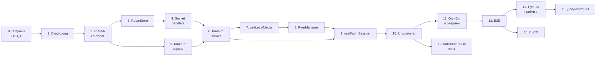

# Implementation Plan — Видеочат-комната (`video-chat-room`)

| | |
|---|---|
| **Документ** | Implementation Plan (IP) |
| **Версия** | 1.0 |
| **Входные документы** | `prd-video-chat-room.md` v1.0, `design-video-chat-room.md` v1.0 |
| **Шаблон** | `prd-tasks.mdc` |
| **feature-name** | `video-chat-room` |
| **Всего задач** | 16 групп / 78 атомарных подзадач |
| **Оценка** | ≈ 27 человеко-дней (без параллелизации) |

**Обозначения.** `_Requirements:_` — номера функциональных требований PRD §4 (ФТ-N) и user stories (US-N); `_Design:_` — разделы TDD. Оценки в скобках: `(0.5 д)` = 0.5 рабочего дня. Каждая подзадача = один MR/PR ≤ 1 дня.

---

## Порядок исполнения и контрольные точки

| Веха | Состав | Что проверяемо по факту | Накопленно |
|---|---|---|---|
| **M0 — Каркас** | 1, 2 | `/health` отвечает, статика раздаётся, `npm test` зелёный | ~3 д |
| **M1 — Presence без медиа** | 3, 4, 5, 6 | 4 участника входят по ссылке, 5-й получает «Комната заполнена», список участников живой, чат работает | ~10 д |
| **M2 — Звонок 1:1** | 7, 8, 9, 10.1–10.3 | двое видят и слышат друг друга | ~16 д |
| **M3 — Полная комната** | 10.4–10.8, 11 | 4 плитки 2×2, тумблеры, заглушки, все экраны ошибок | ~20 д |
| **M4 — Верификация** | 12, 13, 14 | E2E зелёные, ручной чек-лист пройден | ~25 д |
| **M5 — Продакшн** | 15, 16 | задеплоено, README есть | ~27 д |

**Критический путь:** 1 → 2 → 3 → 4 → 6 → 7 → 8 → 9 → 10 → 13. Группы 3–4 (backend) и 5 (каркас клиента) параллелятся после задачи 2; группа 12 параллельна 13.

**Definition of Done для любой подзадачи:** код + unit/integration-тест на новое поведение + `tsc --noEmit` и ESLint без ошибок + ссылка на требование ФТ/US в описании PR + git-чекпоинт перед началом следующей.

---

# Implementation Plan

- [x] **0. Закрыть блокирующие открытые вопросы** — выполнено, отчёт: `acceptance-0-video-chat-room.md`
  - Снять `TBD` из TDD §14, без которых нельзя начинать кодить.
  - [x] 0.1 Подтвердить Q1 (существующий репозиторий/скаффолд), Q2 (TypeScript vs plain JS), Q3 (целевая среда деплоя и TLS), Q4 (версия Node LTS). При наличии репозитория — заполнить TDD §2 сводкой прочитанных файлов. (0.25 д)
    - _Requirements: —, Design: §2.1, §14 (Q1–Q4)_
    - Результат: TDD v1.1 — §2.1 заполнен фактической сводкой (кода в репозитории нет, greenfield подтверждён), §14.1 содержит решения Q1–Q4: TS `strict`, один контейнер за nginx, Node 20 LTS (`.nvmrc`).
  - [x] 0.2 Зафиксировать значения Q5–Q11 в `server/config.ts` и `client/src/config.ts` как дефолты (лимит сообщения, глубина истории, антифлуд, индикация соединения). Уточняются по ходу, не блокируют старт. (0.25 д)
    - _Requirements: ФТ-40, Design: §12.5, §14 (Q5–Q11)_
    - Результат: `server/src/config.ts` (путь по TDD §2.2) и `client/src/config.ts`; TDD §14.2 и §12.5 приведены в соответствие. Дефолты: сообщение 500, история 200, антифлуд 5 + 1/с, индикация соединения включена, `maxBitrate` выключен, `/health` только внутри сети, системное сообщение при shutdown включено.

---

- [ ] **1. Скаффолд монорепо и окружение разработки**
  - Рабочее окружение, в котором `getUserMedia` доступен, а сервер раздаёт клиент с одного origin.
  - [ ] 1.1 Инициализировать монорепо: npm workspaces `client` / `server` / `shared`, общий `tsconfig`, скрипты `dev` / `build` / `test`. (0.5 д)
    - _Requirements: —, Design: §2.2_
  - [ ] 1.2 Настроить ESLint + Prettier, включая **обязательные правила-«стражи»**: `react/no-danger` (запрет `dangerouslySetInnerHTML`) и запрет обращений к `localStorage` / `sessionStorage` / `document.cookie`. (0.5 д)
    - _Requirements: ФТ-39, PRD §5 (без сохранения состояния на клиенте), Design: §5.4, §10.3_
  - [ ] 1.3 Поднять Express: `GET /health` со счётчиками комнат/участников/uptime и SPA-fallback, отдающий `index.html` на любой путь (иначе прямой переход по `/:roomId` даст 404). (0.25 д)
    - _Requirements: ФТ-4, Design: §6.1_
  - [ ] 1.4 Поднять Socket.io-сервер: `transports: ['websocket']`, `maxHttpBufferSize: 100_000`, `pingInterval` / `pingTimeout` из env, логгер `pino` **без логирования текста сообщений**. (0.5 д)
    - _Requirements: ФТ-31, ФТ-35, Design: §4.1, §4.3, §10.5, §12.5_
  - [ ] 1.5 Настроить Vite dev-server: HTTPS через `mkcert` и proxy `/socket.io` → `:3001` с `ws: true`, чтобы dev-конфигурация повторяла прод (один origin, без CORS). (0.5 д)
    - _Requirements: PRD §7 (HTTPS обязателен), Design: §12.1_
  - [ ] 1.6 Собрать `Dockerfile` (multi-stage: build клиента → Node раздаёт статику) и `docker-compose.yml` для прод-подобного локального прогона. (0.5 д)
    - _Requirements: —, Design: §12.1, §12.2_

---

- [ ] **2. Общий контракт `shared/`**
  - Единый источник истины по типам и валидации для клиента и сервера — делается до backend и frontend.
  - [ ] 2.1 Описать типы данных: `MediaState`, `Participant`, `ChatItem` (discriminated union `user` / `system`), `RoomSnapshot`. (0.5 д)
    - _Requirements: ФТ-25, ФТ-30, Design: §5.2, §6.2_
  - [ ] 2.2 Описать типы событий `ClientToServer` / `ServerToClient` целиком по таблицам контракта, включая типы ack и перечисления ошибок (`JoinError`, `ChatError`). (0.5 д)
    - _Requirements: ФТ-8, ФТ-24, ФТ-40, Design: §6.2_
  - [ ] 2.3 Реализовать zod-схемы `nameSchema` (whitelist `\p{L}\p{N}` + пробел/`.`/`_`/`-`, срезание управляющих и zero-width символов, ≤30), `textSchema` (trim, 1..500), `roomIdSchema` (`^[A-Za-z0-9_-]{4,64}$`). (0.5 д)
    - _Requirements: ФТ-24, ФТ-38, ФТ-40, US-1, Design: §5.3, §10.3_
  - [ ] 2.4 Написать unit-тесты валидации: пустое имя, пробелы, zero-width, >30 символов, `<script>`, кириллица с дефисом, пустое сообщение. (0.25 д)
    - _Requirements: ФТ-24, ФТ-38, US-1, Design: §11.2_

---

- [ ] **3. `RoomStore` — состояние комнат в памяти**
  - Единственный владелец состояния; здесь живёт атомарность лимита в 4 участника.
  - [ ] 3.1 Реализовать структуры `Room` / `Participant` (`Map` по `socket.id`) и `get` / `createIfAbsent`: неизвестный `roomId` создаёт комнату, состояния «комната не найдена» не существует. (0.25 д)
    - _Requirements: ФТ-5, ФТ-6, US-4, Design: §4.2, §5.2_
  - [ ] 3.2 Реализовать **строго синхронный** `join()`: проверка `size >= MAX_PARTICIPANTS` и вставка в одном блоке, **без единого `await`**; вернуть `ROOM_FULL` при переполнении. Закрепить требование комментарием в коде. (0.5 д)
    - _Requirements: ФТ-7 (F-05), ФТ-8, US-5, Design: §4.2, §7.2_
  - [ ] 3.3 Реализовать `leave()`: удаление участника и **немедленное** удаление комнаты при падении счётчика до нуля (id и история чата исчезают, grace-периода нет). (0.25 д)
    - _Requirements: ФТ-9, ФТ-27, US-10, Design: §4.2, §7.4_
  - [ ] 3.4 Реализовать `addMessage()` с ring buffer на `MAX_MESSAGES` (дефолт 200) и генерацией `messageId`. (0.25 д)
    - _Requirements: ФТ-23, Design: §4.2, §5.2_
  - [ ] 3.5 Unit-тесты `RoomStore`: создание по неизвестному id; отказ 5-му; **10 синхронных `join` в одном тике впускают ровно 4** (проверка атомарности); удаление комнаты с историей; повторный вход по тому же id даёт пустую комнату; обрезка истории. (0.5 д)
    - _Requirements: ФТ-5, ФТ-7, ФТ-8, ФТ-9, US-1, US-5, Design: §7.2, §11.2_

---

- [ ] **4. Socket-обработчики (backend)**
  - Валидация входящих событий, релей сигналинга, presence и чат. Зависимость: после 2 и 3.
  - [ ] 4.1 `room:join`: валидация `roomId` / `name`, вызов `RoomStore.join`, ack с полным `RoomSnapshot` (участники + история + `self`), `socket.join(roomId)`, запись `socket.data.roomId`, broadcast `peer:joined` остальным. (0.5 д)
    - _Requirements: ФТ-1, ФТ-4, ФТ-8, ФТ-23, ФТ-26, Design: §4.3, §6.2, §6.3, §7.1_
  - [ ] 4.2 Guard `NOT_IN_ROOM`: сокет, не прошедший `room:join`, игнорируется всеми остальными обработчиками. (0.25 д)
    - _Requirements: —, Design: §4.3, §8.2_
  - [ ] 4.3 `room:leave` и `disconnect` (единый путь): `RoomStore.leave`, broadcast `peer:left` + системное сообщение **«покинул комнату»** (формулировку «соединение потеряно» не используем). (0.5 д)
    - _Requirements: ФТ-25, ФТ-27, ФТ-28, ФТ-31, US-10, US-11, Design: §4.3, §7.4, §8.4_
  - [ ] 4.4 Релей `signal:offer` / `signal:answer` / `signal:ice` с подстановкой `from` и **проверкой, что `to` — участник той же комнаты**; иначе молча отбросить. (0.5 д)
    - _Requirements: ФТ-10, Design: §4.3, §6.2, §7.1_
  - [ ] 4.5 `media:state`: обновить `Participant.media` в сторе (чтобы поздний участник получил актуальное состояние в снапшоте) и ретранслировать остальным. (0.25 д)
    - _Requirements: ФТ-15, ФТ-16, ФТ-17, ФТ-18, Design: §4.4, §6.2_
  - [ ] 4.6 `chat:message`: валидация, серверный `ts`, запись в ring buffer, broadcast **всем включая автора** (без оптимистичного локального дубля), ack `{ok, id}`. (0.5 д)
    - _Requirements: ФТ-21, ФТ-22, ФТ-24, Design: §6.2, §7.5_
  - [ ] 4.7 `rateLimiter`: token bucket на сокет для чата (burst 5, refill 1/с → `RATE_LIMITED`) и лимит 100 `signal:*` / 10 с с отключением сокета. (0.5 д)
    - _Requirements: ФТ-40, Design: §4.3, §10.4_
  - [ ] 4.8 Безопасность транспорта: `helmet()`, CSP (`default-src 'self'`, `media-src 'self' blob:`, `connect-src 'self' wss:`), точный список CORS-origin. (0.5 д)
    - _Requirements: ФТ-39, Design: §10.4_
  - [ ] 4.9 Graceful shutdown: на `SIGTERM` разослать системное сообщение о завершении работы, подождать 2 с, закрыть соединения. (0.25 д)
    - _Requirements: ФТ-35, Design: §12.4, §14 (Q10)_
  - [ ] 4.10 Integration-тесты контракта, часть 1 (presence): 4 входа → `peer:joined` у всех; 5-й → `ROOM_FULL`; два `join` в одном тике при 3 занятых слотах → ровно один `ok:true`; `disconnect` → `peer:left` + системное сообщение. (0.5 д)
    - _Requirements: ФТ-7, ФТ-8, ФТ-25, ФТ-31, US-5, Design: §11.3 (1, 2, 6)_
  - [ ] 4.11 Integration-тесты контракта, часть 2 (сигналинг, чат, лимиты): релей доходит с корректным `from`; сокет из **другой** комнаты сигналинг не получает; порядок 50 сообщений сохранён; поздний клиент получает историю; `media:state` попадает в снапшот следующего входящего; флуд даёт `RATE_LIMITED` без разрыва сокета. (0.5 д)
    - _Requirements: ФТ-21, ФТ-23, ФТ-40, US-8, Design: §11.3 (3, 4, 5, 7, 8)_

---

- [ ] **5. Клиент: каркас, стартовый экран, состояние**
  - Всё, что работает до подключения к серверу. Параллельно с 3–4 после задачи 2.
  - [ ] 5.1 `lib/support.ts` + `detectWebRtcSupport()`: проверка `RTCPeerConnection` и `navigator.mediaDevices.getUserMedia` **до монтирования App**, при отсутствии — полноэкранное сообщение о неподдерживаемом браузере. (0.25 д)
    - _Requirements: ФТ-36, US-13, Design: §2.2, §8.1_
  - [ ] 5.2 `config.ts` (ICE-серверы, лимиты, `SOCKET_URL`, флаги) и `strings.ts` — все русские строки UI и ошибок в одном модуле, без i18n-библиотеки. (0.25 д)
    - _Requirements: PRD §6 (только русский), Design: §2.2, §12.5_
  - [ ] 5.3 Роутинг: `/` → `JoinScreen`, `/:roomId` → `RoomPage`; генерация `roomId` через `nanoid(12)` на клиенте при «Создать комнату» + переход на URL комнаты. (0.5 д)
    - _Requirements: ФТ-2, ФТ-4, US-2, US-4, Design: §5.3, §6.1_
  - [ ] 5.4 `JoinScreen`: поле имени с клиентской валидацией (зеркало серверной, ≤30, whitelist), подсказка при пустом имени, кнопки «Создать комнату» / «Войти». (0.5 д)
    - _Requirements: ФТ-1, ФТ-38, US-1, Design: §10.3_
  - [ ] 5.5 `roomReducer` + машина состояний экрана (`checkingSupport` → `idle` → `acquiringMedia` → `connecting` → `inRoom` / `roomFull` / `serverError` / `left`). Ключевое свойство: ошибка медиа **не может** быть терминальной. (0.5 д)
    - _Requirements: ФТ-8, ФТ-14, ФТ-33, ФТ-35, Design: §3.3, §5.4, §8.3_
  - [ ] 5.6 `lib/format.ts`: `formatTime(ts)` → `HH:MM` по локали клиента на **кешированном** инстансе `Intl.DateTimeFormat` (один на приложение). (0.25 д)
    - _Requirements: ФТ-22, Design: §6.2, §9.3_

---

- [ ] **6. Клиент: socket-сервис**
  - Подключение и трансляция ошибок транспорта в состояния экрана. Зависимость: после 4 и 5.
  - [ ] 6.1 `createSocket()`: `reconnection: false` (auto-reconnect запрещён требованием), `autoConnect: false`, `transports: ['websocket']`, `timeout: 8000`. (0.25 д)
    - _Requirements: ФТ-31, US-11, Design: §4.1_
  - [ ] 6.2 Отправка `room:join` и обработка ack: `ok` → `inRoom`, `ROOM_FULL` → экран «Комната заполнена», `INVALID_ROOM_ID` → редирект на `/`. (0.5 д)
    - _Requirements: ФТ-8, US-5, Design: §6.2, §8.1_
  - [ ] 6.3 Обработка `connect_error` / `timeout` → экран ошибки сервера; собственный `disconnect` → экран ошибки + полный teardown (закрыть все PC, остановить дорожки). (0.5 д)
    - _Requirements: ФТ-31, ФТ-35, US-13, Design: §4.1, §8.1, §8.3_

---

- [ ] **7. Клиент: `useLocalMedia` — локальные дорожки и тумблеры**
  - Микрофон и камера ведут себя принципиально по-разному — это требование PRD, не удобство реализации.
  - [ ] 7.1 **Раздельные** вызовы `getUserMedia` для audio и video, каждый в своём `try/catch`: отсутствие одного устройства не должно ронять получение другого. (0.5 д)
    - _Requirements: ФТ-13, ФТ-14, US-6, Design: §4.4_
  - [ ] 7.2 Маппинг ошибок `getUserMedia` в `MediaErrorKind`: `NotAllowedError`, `NotFoundError`, `NotReadableError`, `OverconstrainedError` (с retry на ослабленных constraints); во всех случаях вход в комнату продолжается. (0.5 д)
    - _Requirements: ФТ-14, ФТ-33, US-12, Design: §4.4, §8.1, §8.3_
  - [ ] 7.3 Тумблер микрофона через `track.enabled` (дорожка остаётся живой) + `emit media:state`. (0.25 д)
    - _Requirements: ФТ-15, ФТ-16, US-7, Design: §4.4_
  - [ ] 7.4 Тумблер камеры: выключение — `sender.replaceTrack(null)` на всех PC **плюс** `track.stop()` для гашения аппаратного индикатора; включение — повторный `getUserMedia` + `replaceTrack(newTrack)`. **`removeTrack` не использовать** (иначе 6 SDP-обменов на клик). (0.5 д)
    - _Requirements: ФТ-17, ФТ-19, US-7, Design: §4.4, §4.5, §7.3, R4_
  - [ ] 7.5 Обработчик `track.onended`: тумблер → off, `emit media:state`, баннер «Устройство отключено»; подписка на `navigator.mediaDevices.ondevicechange`. (0.25 д)
    - _Requirements: ФТ-20, US-7, Design: §4.4, §8.1_
  - [ ] 7.6 `teardown()`: остановка **всех** дорожек при выходе и размонтировании — иначе камера продолжает работать после выхода. (0.25 д)
    - _Requirements: ФТ-27, Design: §4.4, R7_

---

- [ ] **8. Клиент: `PeerManager` — mesh WebRTC**
  - Ядро технической сложности. Обычный класс без зависимости от React (тестируется в изоляции, не вызывает ре-рендер на каждый ICE-кандидат).
  - [ ] 8.1 Скелет: `Map<peerId, PeerEntry>`, `ICE_CONFIG` (Google STUN, `iceCandidatePoolSize: 2`), колбэки наружу, `addPeer` / `removePeer`. (0.5 д)
    - _Requirements: ФТ-10, PRD §7 (STUN без TURN), Design: §4.5_
  - [ ] 8.2 При создании PC добавлять **ровно два трансивера в фиксированном порядке** (`audio`, затем `video`, `direction: 'sendrecv'`) и подставлять локальные дорожки через `replaceTrack`. Даёт одинаковую форму SDP при отсутствии устройств и отсутствие ренегоциации при включении камеры. (0.5 д)
    - _Requirements: ФТ-14, ФТ-17, Design: §4.5 (нюанс 1), §7.3_
  - [ ] 8.3 Оффер/ответ по правилу антиглэра: **инициаторы — те, кто уже в комнате**; новичок создаёт PC по списку из ack и только отвечает. Один оффер на пару. (0.5 д)
    - _Requirements: ФТ-10, US-6, Design: §4.5 (нюанс 2), §7.1_
  - [ ] 8.4 Trickle ICE: отправка `signal:ice`, приём и применение; **буфер `pendingCandidates`**, если `pc.remoteDescription === null`, со сбросом сразу после `setRemoteDescription`. (0.5 д)
    - _Requirements: ФТ-10, Design: §4.5 (нюанс 4), §8.2_
  - [ ] 8.5 Perfect negotiation: `polite = selfId > peerId`, флаги `makingOffer` / `ignoreOffer`, `onnegotiationneeded` через `setLocalDescription()` без аргументов. (0.5 д)
    - _Requirements: ФТ-10, Design: §4.5 (нюанс 3), §8.2_
  - [ ] 8.6 Один `remoteStream` на пира, создаваемый вместе с PC; в `ontrack` дорожка **добавляется** в него (`addTrack`), `srcObject` присваивается ровно один раз. (0.25 д)
    - _Requirements: ФТ-10, ФТ-11, Design: §4.5 (нюанс 5)_
  - [ ] 8.7 `onconnectionstatechange`: `failed` → одна попытка `restartIce()`, затем событие наружу для пометки конкретной плитки; **остальные PC и чат продолжают работать**. (0.25 д)
    - _Requirements: ФТ-34, US-13, Design: §4.5 (нюанс 6), §8.3, R1_
  - [ ] 8.8 `replaceOutgoingVideo(track|null)` / `replaceOutgoingAudio(...)` — применение к senders всех PC разом. (0.25 д)
    - _Requirements: ФТ-15, ФТ-17, Design: §4.5, §7.3_
  - [ ] 8.9 `closePeer()` — детерминированный teardown: снять обработчики, `replaceTrack(null)` на всех senders, `pc.close()`, удалить запись из `Map`. Идемпотентен (может прийти `peer:left` до установления соединения). (0.25 д)
    - _Requirements: ФТ-27, ФТ-31, Design: §4.5 (нюанс 7), §8.2, R7_
  - [ ] 8.10 Unit-тесты с мокнутым `RTCPeerConnection`: вычисление роли polite/impolite, `ignoreOffer` при коллизии, буферизация и сброс ICE-кандидатов, идемпотентность `closePeer`, порядок трансиверов. (1 д)
    - _Requirements: ФТ-10, Design: §11.1_

---

- [ ] **9. Клиент: `useRoomSession` — оркестратор**
  - Единственное место, где socket-события связываются с `PeerManager` и React-состоянием. Зависимость: после 6, 7, 8.
  - [ ] 9.1 Подписки: `peer:joined` → `createPeer` + оффер; `peer:left` → `closePeer` + удаление участника; `signal:*` → в `PeerManager`; `media:state` → в reducer; `chat:message` → в историю. (0.5 д)
    - _Requirements: ФТ-25, ФТ-26, ФТ-27, ФТ-31, Design: §4.6, §7.1, §7.4_
  - [ ] 9.2 Хранить `MediaStream` и `RTCPeerConnection` **вне** React-состояния (в `useRef`-мапе), обновляя UI только при появлении/исчезновении пира — иначе видео мигает на каждое изменение дорожки. (0.25 д)
    - _Requirements: ФТ-11, Design: §4.6, §5.4, §9.3_
  - [ ] 9.3 Единый `teardown()` при выходе, `disconnect` и размонтировании: закрыть все PC, остановить дорожки, `socket.disconnect()`. `beforeunload` не нужен — socket.io сам присылает `disconnect`. (0.25 д)
    - _Requirements: ФТ-27, ФТ-28, Design: §4.6, §8.2, R7_

---

- [ ] **10. Клиент: UI комнаты**
  - Зависимость: после 9. Дизайн оценивается по критерию «работает и понятно» (PRD §6).
  - [ ] 10.1 `VideoTile`: `<video autoPlay playsInline>`, **всегда смонтированный** (условный рендеринг элемента убивает аудио пира), `muted` для self-view (иначе гарантированное эхо), присвоение `srcObject` через ref. (0.5 д)
    - _Requirements: ФТ-11, ФТ-12, ФТ-18, Design: §4.7, R5_
  - [ ] 10.2 Оверлеи плитки: заглушка-силуэт с именем при отсутствии видео, иконка перечёркнутого микрофона при выключенном аудио — оба состояния берутся **из `media:state`**, а не из WebRTC-событий. Имя выводится текстом в JSX. (0.25 д)
    - _Requirements: ФТ-12, ФТ-16, ФТ-18, ФТ-39, US-12, Design: §4.4, §4.7_
  - [ ] 10.3 `VideoGrid`: CSS Grid, раскладки 1 / 2 / 3–4 плитки (2×2), корректная работа от 1024px, `aspect-ratio` + `object-fit: cover`. (0.5 д)
    - _Requirements: ФТ-11, PRD §6, Design: §3.1, §4.8_
  - [ ] 10.4 `Controls`: тумблеры микрофона и камеры с визуальным состоянием, кнопка «Выйти». (0.5 д)
    - _Requirements: ФТ-15, ФТ-17, ФТ-27, US-7, US-10, Design: §4.4_
  - [ ] 10.5 Кнопка «Скопировать ссылку»: `navigator.clipboard.writeText(location.href)` + видимое подтверждение, с fallback при отказе Clipboard API. (0.5 д)
    - _Requirements: ФТ-3, US-3, Design: §6.1_
  - [ ] 10.6 `ChatPanel`: рендер истории (пользовательские и системные сообщения одним компонентом), имя + `HH:MM`, поле ввода с disabled-кнопкой при пустом тексте, счётчик до лимита длины. Ссылки **не автолинкуются** (вектор `javascript:`). (0.5 д)
    - _Requirements: ФТ-21, ФТ-22, ФТ-24, ФТ-25, US-8, Design: §7.5, §10.3_
  - [ ] 10.7 `useAutoScroll`: прокрутка к новому сообщению **только если** пользователь уже у нижней границы (`scrollHeight - scrollTop - clientHeight < 50`), чтобы не выдёргивать из чтения истории. (0.25 д)
    - _Requirements: ФТ-23, US-8, Design: §7.5_
  - [ ] 10.8 `ParticipantList`: актуальный состав комнаты в реальном времени, внутренние id не показываются. (0.25 д)
    - _Requirements: ФТ-26, ФТ-30, US-9, Design: §5.3_
  - [ ] 10.9 Оптимизация ре-рендеров: `React.memo` на плитку по `participantId` / `media` / `connectionState` — переписка в чате не должна перерисовывать видеосетку. (0.25 д)
    - _Requirements: —, Design: §9.3_

---

- [ ] **11. Клиент: экраны ошибок и оверлеи**
  - Требование PRD: пользователь никогда не должен упираться в «белый экран». Зависимость: после 10.
  - [ ] 11.1 `RoomFullScreen`: «Комната заполнена» + рабочая кнопка «Повторить вход» (возврат в `acquiringMedia`). (0.25 д)
    - _Requirements: ФТ-8, US-5, Design: §3.3, §8.1_
  - [ ] 11.2 `ServerErrorScreen`: единый текст для «сервер недоступен» и «соединение потеряно» + кнопка «Повторить». (0.25 д)
    - _Requirements: ФТ-35, US-13, Design: §8.1_
  - [ ] 11.3 `UnsupportedScreen`: «Ваш браузер не поддерживает WebRTC» (подключается к 5.1). (0.25 д)
    - _Requirements: ФТ-36, US-13, Design: §8.1_
  - [ ] 11.4 `MediaErrorBanner`: неблокирующий баннер по всем кодам из §8.1, пользователь остаётся в комнате с выключенными устройствами. (0.25 д)
    - _Requirements: ФТ-33, US-12, Design: §8.1, §8.3_
  - [ ] 11.5 `UnmuteAudioGate`: обернуть `video.play()` в `catch`, при `NotAllowedError` показать оверлей «Включить звук», один клик по которому вызывает `play()` для всех элементов. (0.5 д)
    - _Requirements: ФТ-37, US-13, Design: §4.7, R6_
  - [ ] 11.6 Индикация состояния соединения на плитке: `connecting` и «Нет соединения с участником» при `failed` — чтобы отсутствие TURN не выглядело как необъяснимый чёрный экран. (0.25 д)
    - _Requirements: ФТ-34, Design: §8.1, §14 (Q9), R1_

---

- [ ] **12. Компонентные тесты (RTL + jsdom)**
  - Параллельно с 13.
  - [ ] 12.1 `JoinScreen`: валидация имени, disabled-состояния кнопок, подсказки. (0.25 д)
    - _Requirements: ФТ-1, ФТ-38, US-1, Design: §11.1_
  - [ ] 12.2 `VideoTile`: `<video>` присутствует в DOM при `hasVideo === false`; заглушка и иконка микрофона появляются по props; self-view всегда `muted`. (0.5 д)
    - _Requirements: ФТ-12, ФТ-16, ФТ-18, Design: §4.7, §11.1_
  - [ ] 12.3 `ChatPanel`: рендер пользовательских и системных сообщений, формат `HH:MM`, блокировка отправки пустого текста, отображение HTML как текста. (0.5 д)
    - _Requirements: ФТ-22, ФТ-24, ФТ-25, ФТ-39, Design: §11.1_
  - [ ] 12.4 Экраны ошибок и `roomReducer`: переходы машины состояний, включая «ошибка медиа не терминальна». (0.25 д)
    - _Requirements: ФТ-8, ФТ-33, ФТ-35, ФТ-36, Design: §3.3, §11.1_

---

- [ ] **13. E2E-тесты (Playwright + fake media)**
  - Единственный способ прогнать WebRTC в CI без железа. Зависимость: после 11.
  - [ ] 13.1 Конфигурация: Chromium с `--use-fake-device-for-media-stream`, `--use-fake-ui-for-media-stream`, `--allow-insecure-localhost`; фикстура на N независимых browser-контекстов; хелпер чтения `getStats()`. (0.5 д)
    - _Requirements: —, Design: §11.4_
  - [ ] 13.2 E1–E2: звонок двух контекстов (по 2 плитки, входящее видео в статистике); 4 контекста + пятый получает «Комната заполнена» с рабочей кнопкой повтора. (0.5 д)
    - _Requirements: ФТ-8, ФТ-10, ФТ-11, US-5, US-6, Design: §11.4_
  - [ ] 13.3 E3–E5: чат между тремя участниками с именем и `HH:MM`; поздний вход видит предыдущую переписку; XSS-проба (`` отображается как текст, `dialog`-события нет). (0.5 д)
    - _Requirements: ФТ-21, ФТ-22, ФТ-23, ФТ-39, US-8, Design: §11.4_
  - [ ] 13.4 **E6 — ключевой тест дизайна**: при выключении камеры у собеседника появляется заглушка, а `bytesReceived` для **аудио продолжает расти** (ловит регрессию условного рендеринга `<video>`). Плюс E7 — иконка перечёркнутого микрофона. (0.5 д)
    - _Requirements: ФТ-16, ФТ-18, ФТ-19, US-7, Design: §11.4, §4.7, R5_
  - [ ] 13.5 E8–E10: закрытие вкладки → плитка исчезла + системное сообщение; выход последнего + повторный вход → история пуста; копирование ссылки равно `page.url()` с подтверждением. (0.5 д)
    - _Requirements: ФТ-3, ФТ-9, ФТ-25, ФТ-28, US-3, US-10, Design: §11.4_
  - [ ] 13.6 E11–E13: `context.clearPermissions()` → вход состоялся с баннером; остановленный сервер → экран ошибки; 4 участника в раскладке 2×2 при ширине 1024px. (0.5 д)
    - _Requirements: ФТ-11, ФТ-33, ФТ-35, US-12, US-13, Design: §11.4_

---

- [ ] **14. Ручная верификация и приёмка**
  - То, что физически невозможно автоматизировать. Зависимость: после 13.
  - [ ] 14.1 Оформить чек-лист ручных проверок из TDD §11.5 в виде документа приёмки. (0.25 д)
    - _Requirements: —, Design: §11.5_
  - [ ] 14.2 Проверить, что **аппаратный индикатор камеры гаснет** при выключении и загорается при включении (Chrome, Firefox, Edge). (0.25 д)
    - _Requirements: ФТ-19, US-7, Design: §11.5_
  - [ ] 14.3 LAN-прогон между двумя–четырьмя физическими машинами по HTTPS (`mkcert` на LAN-IP): замерить задержку через `getStats()` и подтвердить ≤ 500 мс. (0.5 д)
    - _Requirements: PRD §7 (задержка), US-6, Design: §9.1, §12.1_
  - [ ] 14.4 Физически отключить USB-камеру во время звонка, проверить поведение по ФТ-20 и восстановление через настройки ОС. (0.25 д)
    - _Requirements: ФТ-20, US-7, Design: §11.5_
  - [ ] 14.5 Проверить отсутствие утечек в `chrome://webrtc-internals`: после выхода не осталось живых `RTCPeerConnection` и активных дорожек. (0.25 д)
    - _Requirements: —, Design: §9.1, §11.5, R7_
  - [ ] 14.6 Кросс-браузерный прогон основного сценария: Firefox 100+ и Edge 100+ (Edge — только вручную), отсутствие эха при 4 живых микрофонах. (0.5 д)
    - _Requirements: PRD §7 (поддержка браузеров), Design: §11.5, R9_
  - [ ] 14.7 Замерить CPU клиента при 4 участниках; при упирании в канал включить `VITE_MAX_VIDEO_BITRATE` и перепроверить. (0.25 д)
    - _Requirements: —, Design: §9.2, §9.3, §14 (Q5), R2_

---

- [ ] **15. CI/CD и деплой**
  - Параллельно с 14 после 13.
  - [ ] 15.1 CI-пайплайн из 7 шагов: `npm ci` → `tsc --noEmit` + ESLint → `vitest run --coverage` (порог 75 %) → `vite build` → Playwright против собранного артефакта → `docker build` → деплой с проверкой `/health`. (0.5 д)
    - _Requirements: —, Design: §11.1, §12.3_
  - [ ] 15.2 Конфигурация nginx: TLS, `proxy_set_header Upgrade` / `Connection "upgrade"` (без них WebSocket молча не поднимется), `proxy_read_timeout 300s`. (0.25 д)
    - _Requirements: PRD §7 (HTTPS), Design: §12.2_
  - [ ] 15.3 Развернуть в целевой среде, проверить `/health` и `wss://`, зафиксировать процедуру rollback (редеплой предыдущего образа). (0.5 д)
    - _Requirements: —, Design: §12.2, §12.5_
  - [ ] 15.4 Проверить сетевые предусловия среды: исходящий UDP на `stun.l.google.com:19302` и произвольные высокие UDP-порты между клиентами. Если UDP закрыт — приложение не заработает без TURN, зафиксировать как результат проверки. (0.25 д)
    - _Requirements: ФТ-34, Design: §12.2, R1_

---

- [ ] **16. Документация**
  - Зависимость: после 15.
  - [ ] 16.1 `README.md`: запуск в dev (включая `mkcert` и почему на `http://192.168.x.x` `getUserMedia` не работает), сборка, `docker compose`, таблица env-переменных и флагов. (0.5 д)
    - _Requirements: —, Design: §12.1, §12.5_
  - [ ] 16.2 Раздел «Известные ограничения»: нет TURN (пары за симметричным NAT не соединятся), лимит 4 из-за mesh, один stateful инстанс (рестарт рвёт все звонки), Safari вне поддержки, capacity-DoS как следствие отсутствия авторизации. (0.25 д)
    - _Requirements: ФТ-6, ФТ-34, Design: §13 (R1, R2, R3, R9, R11)_
  - [ ] 16.3 Обновить TDD: заполнить §2 фактической сводкой файлов и снять закрытые `TBD` из §14 (версия `design-video-chat-room-v2.md`). (0.25 д)
    - _Requirements: —, Design: §2.1, §14_

---

## Отложено (реализуется только при изменении требований)

Ниже — задачи, **не входящие** в объём: они появятся, если PRD §5 (Non-Goals) будет пересмотрен. Зафиксированы, чтобы дизайн уже был к ним готов.

| Задача | Триггер | Готовность дизайна |
|---|---|---|
| Подключить TURN-сервер | R1 подтверждён на реальных сетях (пары не соединяются) | изолировано за `VITE_ICE_SERVERS` — изменение конфигурации, не кода |
| Redis-adapter + атомарный счётчик в Redis | нужна больше одного инстанса сервера | путь описан в §9.4 |
| Переход на SFU (LiveKit/mediasoup) | нужно > 4 участников | требует переписывания медиаслоя, §9.2 |
| Auto-reconnect | пересмотр ФТ-31 | сейчас сознательно выключен (`reconnection: false`) |
| Сбор `getStats()` в мониторинг | нужна наблюдаемость качества связи | R13 |
| Нагрузочное тестирование сигналинга (k6) | валидация оценок §9.4 | §11.5 |

---

## Сводка по областям

| Область | Задачи | Оценка |
|---|---|---|
| DevOps / окружение | 1, 15 | 4.0 д |
| Общий контракт | 2 | 1.75 д |
| Backend | 3, 4 | 5.75 д |
| Frontend: каркас и состояние | 5, 6 | 3.5 д |
| Frontend: медиа и WebRTC | 7, 8, 9 | 6.5 д |
| Frontend: UI | 10, 11 | 5.25 д |
| Тесты (unit / integration / component / E2E) | входят в 2–13 | ≈ 7 д из указанных выше |
| Ручная приёмка | 14 | 2.25 д |
| Документация | 16 | 1.0 д |
| **Итого** | **78 подзадач** | **≈ 27 д** |

БД-области нет: база данных в проекте отсутствует по требованию PRD (TDD §5.1), миграций и схем нет.
